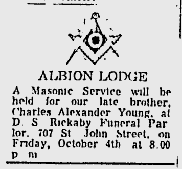

# Le Quatrième Soldat

## Fr Maj Charles Alexander Young, MC, VD

Date of birth: Nov 26th 1895     
Place of birth: Toronto, ON   
Next of kin: Alexander Young, father, 24 St-Julia St, Quebec, Quebec   
Occupation: Machinist, metalworking machine setter-operator    
Religion: Methodist   

Date of Death: Oct 2nd 1963    
Buried: Mount Hermon Cemetery, Quebec City    

*First World War:*   

**Service:** Canadian Expeditionary Force   
**Regimental number:** 22822   
**Highest rank:** Lieutenant   
**Rank detail:**     
1. Lieutenant (Army) 1918-03-19 to 1919-06-12    
2. Lieutenant (Army) 1917-08-31 to 1918-03-19    
3. Lieutenant (Army) 1917-04-14 to 1917-08-30    
4. Sergeant   (Army) 1917-02-01 to 1917-04-14    
5. Sergeant   (Army) 1916-06-13 to 1917-02-01    
6. Sergeant   (Army) 1915-10-14 to 1916-06-13    
7. Quarter-Master Sergeant, 12th Battalion, Infantry (Army) 1915-08-23 to 1915-10-14    
8. Sergeant, 12th Battalion, Infantry (Army) 1914-09-29 to 1915-08-23  
Degree of service: Europe
Awards:
- Military Cross   
  Date of award: 1919-06-03   
  Source: London Gazette, No. 31370, pg. 6837    
    *Lt. Charles Alexander Young, 4th Bn., Can.    
    M.G. Corps*

LACID:  [330882](https://www.bac-lac.gc.ca/eng/discover/military-heritage/first-world-war/personnel-records/Pages/item.aspx?IdNumber=330882)    
Service File: [B10645-S029](https://central.bac-lac.gc.ca/.item/?op=pdf&app=CEF&id=B10645-S029)    
Reference: RG 150, Accession 1992-93/166, Box 10645 - 29    
Item Number: 330882    
Record Group: Canadian Expeditionary Force (CEF)     

*Second World War*
<table border="0" width="100%">
  <tr>
    <td><!-- img src="https://www.hkvca.ca/cforcedata/ext_files/masterimage/X96.jpg" ALIGN=”right” HSPACE=”50” VSPACE=”50”/ -->
      
    </td>
    <td align="top">
      <b>Rank:</b> Major (retired Lieutenant-Colonel)    
      <b>Force:</b> Army - 1st Btn The Royal Rifles of Canada.   
      <b>Service Number (regimental):</b> X96.   
      <b>Born:</b> November 26, 1895, York, On.   
      <b>POW:</b> from Dec 30, 1941 to Sep 10, 1945.   
      <b>Died:</b> Outober 2, 1963, Toronto, On.   
      <b>Buried:</b> Mount Hermon Cemetery, Quebec, QC.   
      <b>Decorations:</b> Military Cross, Volunteer's Officer Decoration.   
    </td>
  </tr>
</table>

Son of Major Alexander 'Alex' Young (52nd Battalion) and Annie Buxton Young (née Gardiner); husband of Irene May Young (née Fellows).

After the Great War, he joined the Royal Rifles of Canada and rose through the ranks to become Lieutenant-Colonel in 1934.

À la Second Guerre mondiale, il est capturé à la fin de la Bataille d'Hong Kong, sera envoyé en camp de prisonniers dans lesquels il restera jusqu'à la fin de la guerre en 1945.

**Liste des camps de prisonniers et les dates d'internement et de sortie:** 

|Camp ID 	|Camp Name 	|Location 	|Company 	|Type of Work 	|Reference 	|Arrival Date 	|Departure Date|
|---|----|----|---|---|---|---|---|
|HK-NP-01	|North Point	|North Point, Hong Kong Island|||				|41 Dec 30	|42 Sep 26|
|HK-SA-02	|Shamshuipo	|Kowloon, Hong Kong||||				|42 Sep 26	|43 Aug 19|
|HK-AS-02	|Argyle Street	|Kowloon, Hong Kong|||			20, 33|	43 Aug 19 	|44 May 11|
|HK-SA-02	|Shamshuipo	|Kowloon, Hong Kong|||			20, 33|	44 May 11	|45 Sep 10|

*In the fourth row from the bottom, 3rd from the left is X96 Major Charles A. Young of the Royal Rifles of Canada. Apparently this photo was taken just after liberation*

Hong Kong Veterans Commemorative Association,   
https://www.hkvca.ca/cforcedata/unitreport/index.php 

Details from HKVCA.   
https://www.hkvca.ca/cforcedata/indivreport/indivdetailed.php?regtno=X96

Je me souviens   
https://www.worldanvil.com/w/je-me-souviens/a/young2C-charles-alexander--ww2--person

HKVCA Vault. Search by reg'l number.   
https://drive.google.com/drive/folders/1u0605cQjINZtg6Xp33LPBr4FxOQ1MOcJ

CANADIAN PARTICIPATION IN THE DEFENCE OF HONG KONG, DECEMBER, 1941   
https://www.ibiblio.org/hyperwar/UN/Canada/CA/163-HongKong/index.html#pow

War Diary.  
https://www.hkvca.ca/Gallery/Individuals/Maj%20Charles%20Young/index.htm

http://battleofhongkong.com/19.htm

First World War Records:   
https://canadiangreatwarproject.com/person.php?pid=193906

**Decorations:**   

Military Cross  
La Croix militaire peut être décernée aux officiers de grades ne dépassant pas le grade effectif de capitaine (autrement dit, les majors à titre temporaire et par intérim y sont admissibles) ou aux adjudants, en reconnaissance de services distingués et méritoires au combat. En 1920, les conditions ont été modifiées afin de préciser clairement que la Croix devait reconnaître les services courageux et distingués en présence de l’ennemi, et que les officiers de la marine et de l’aviation pouvaient l’obtenir pour des services courageux et distingués au sol. - Anciens Combattants Canada.   
https://www.worldanvil.com/w/je-me-souviens/a/croix-militaire-item

Identifying the need to recognize junior commissioned officers and senior non-commissioned officers, the Military Cross was established on 28 December 1914 for commissioned officers of the substantive rank of Captain or below and for Warrant Officers. It was awarded for gallant and distinguished service in battle and recipients were entitled to the post-nominal letters MC.   
https://www.warmuseum.ca/tilston-medals-collection/medals/25/

**Obituary and Albion's Invitation  Chronicle, 1693-10-03, p. 12**   
https://news.google.com/newspapers?nid=9tXw7Op4-u0C&dat=19631003&printsec=frontpage&hl=en    
YOUNG - Suddenly at Toronto, Ont. on October 2nd 1963, Lt-Col C.A. Young, MC, VC, ED, beloved husband of the late Irene Fellows and dear father of Donald and Phyllis (Mrs Harry Thompson). Resting at the D.S. Rickaby Funeral Home, 707 St John Street, corner Geneviève (...). Funeral Saturday, at 2.00 service in Chalmers Wesley Church, Interment Mount Hermon Cemetery. 

**ALBION LODGE**
A Masonic Service will be held for our late brother, Charles Alexander Young, at D.S. Rickaby Funeral Parlor, 707 St John Street, on Friday, October 4th at 8.00 pm.

**Info about Lt-Col Young. Chronicle, 1963-10-05, p. 3**   
https://news.google.com/newspapers?nid=9tXw7Op4-u0C&dat=19631005&printsec=frontpage&hl=en

Lt-Col C.A. Young Known as a Soldier and Sportsman 

Lt-Col C.A. Young of Quebec, who died recently at Toronto, spent the Second World War wit the Royal Rifles of Canda and commanded the last group of soldiers to surrender on the island. 

A veteran of both world wars, he was awarded the Military Cross for bravery in the Second World War. 

Well know in his youth as a sportsman, he became quite famous as a hockey player here. Among other sporting activities, he also excelled at curling. 

He was also a president of the Army, Navy and Airforce Association for many years. 

The 68-year-old army officer, who leaves many friends behind, was greatly admired by the men serving under his command. 

At the time of his sudden death, he was visiting his daughter, Mrs Harry Thompson, in Toronto. 

His father, the late Maj Alexander Young, was also a soldier and commanded the 52nd Battalion in the First World War. 

**His daughter:**   
Phyllis Alexandra Thompson, née Young   
January 10, 1931 — April 5, 2020  
https://www.basicfunerals.ca/obituaries/Phyllis-Thompson

**Wife**: 
Irene May Fellows (Imperial War Museum - Lives of the First World War)    
Daughter of **Alfred Grincell Fellows** and **Catherine Fellows** (nee Black); wife of **Charles Alexander Young** (Service No. 22822)
Date of birth: Sept 16th 1894   
Place of birth: Quebec, PQ   
Next of kin: Major William Grincell Fellows, uncle. 243 Fairmount Avenue, Montreal, Quebec   
Occupation (attested): Trained Nurse    
Address: 61 St. Cyrille Street, Quebec, Quebec    
Religion: Church of England    
Date of death: 1958-12-05    
Buried: St. Catharines (Victoria Lawn) Cemetery    
Service: Canadian Expeditionary Force    	  
Unit: Canadian Army Medical Corps 	 
Rank: Nursing Sister (Lieutenant)	  
Service File:  [B3029-S033](https://central.bac-lac.gc.ca/.item/?op=pdf&app=CEF&id=B3029-S033)     
IWM: https://livesofthefirstworldwar.iwm.org.uk/lifestory/5857947    
Great War Project: https://canadiangreatwarproject.com/person.php?pid=87189

Wife's Father: SGM Alfred Grincell Fellows   
Sergeant-Major RCGA - Royal Canadian Garrison Artillery, 8th Regiment, "B" Battery - Québec City  
Husband of Caroline H Reid (1873 – 1948)   
Born: May   7th 1868, England   
Died: April 6th 1912 (44 years old)   
Grave of Alfred Grincell Fellows:   
https://www.findagrave.com/memorial/156652478/alfred_grincell_fellows   

Wife's Brother :    
Ivor Herbert Fellows, son of Alfred Grincell Fellows, Sergeant-Major R C G A, of Québec, and of his wife Caroline, born the fifth day of April, A D 1906, was baptised on June 18th of the same. Died on the twenty-third and was buried on the twenty-fourth day of February, A D 1914 (7 years old). 
Grave:   
https://www.findagrave.com/memorial/156648143/ivor_herbert_fellows

54 Rifles un Jap's hands.    
https://www.proquest.com/docview/2158853737/ED9F788F4219403CPQ/2?accountid=8612&sourcetype=Historical%20Newspapers

