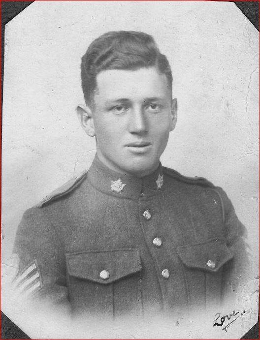
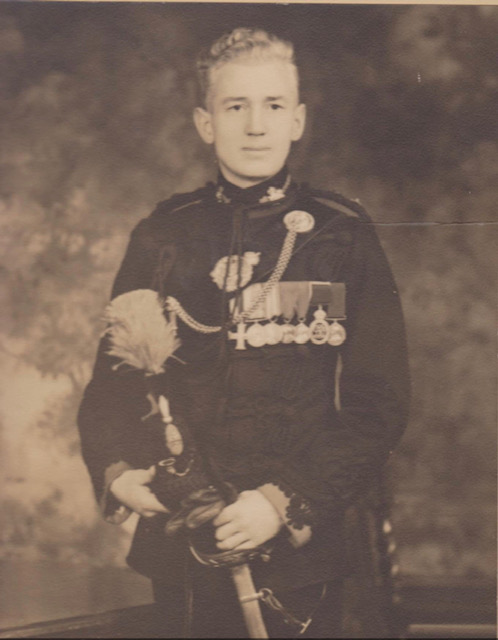
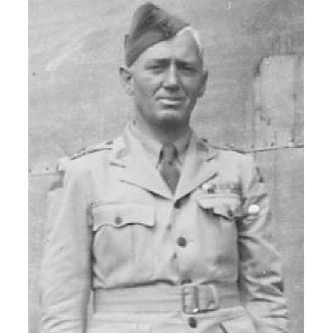
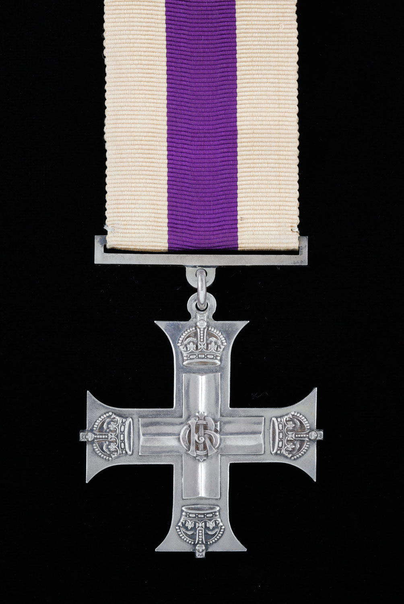
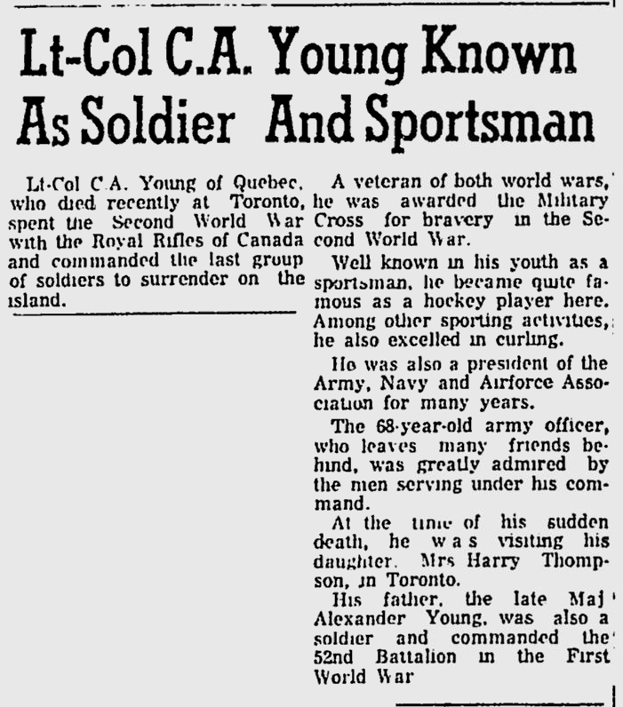
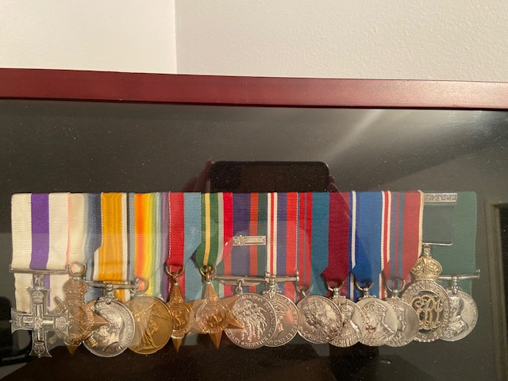
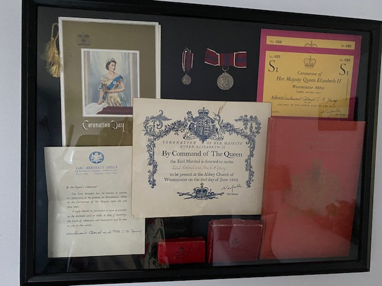
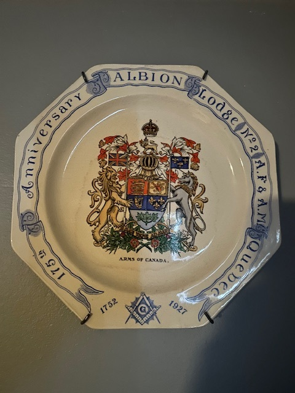
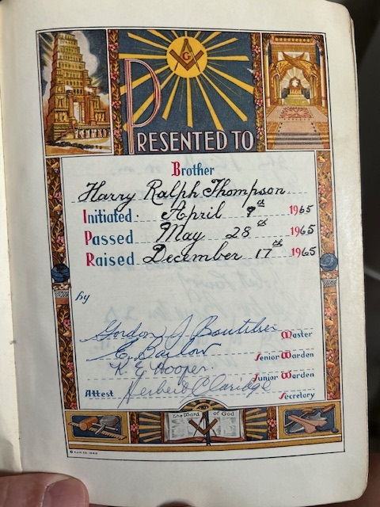
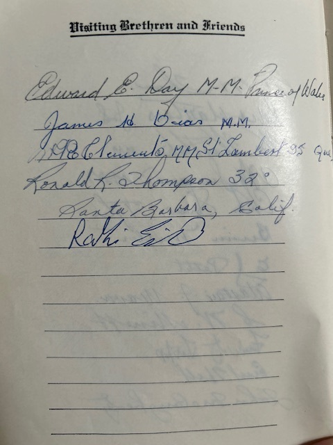

<!-- ENTETE -->

---

    

--- 

<!-- FIN ENTETE -->

# Le Quatrième Soldat:  TVF Lt-Col Charles Alexander Young, MC, VD

||CIVIL DATA|
|---|---|
|Name|Charles Alexander Young|
|Date of birth|Nov 26th 1895|
|Place of birth|County of York, Toronto, ON|
|Father|Alexander Young|
|Mother|Annie Buxton Young, née Gardiner|
|Next of kin|Alexander Young, father, 24 St-Julia St, Quebec City, QC|
|Occupation|Machinist, metalworking machine setter-operator|
|Religion|Methodist ([Chalmers Wesley United Church](https://chalmerswesley.org/), Quebe City, QC)|
|Date of death|Oct 2nd 1963|
|Place of death|Toronto, ON|
|Age at death|67 y-o|
|Burial site|[Mount Hermon Cemetery](https://www.mounthermoncemetery.com/), Quebec City, QC.   Lot #1804, Section K.   GPS coords: [46.7787065583,-71.2467289583](https://www.google.com/maps/search/?api=1&query=46.7787065583,-71.2467289583) |

Son of Major Alexander 'Alex' Young (52nd Battalion) and Annie Buxton Young (née Gardiner); husband of Nursing Sister Lieutenant Irene May Young (née Fellows).

At the First World War, he served the Canadian Machine Gun Corps, with a rank of Lieutenant, teaching Machine Gun usage to the troops in England, before being shipped to the French front. 

After the Great War, he joined the Royal Rifles of Canada and rose through the ranks to become Lieutenant Colonel in 1934.

À la Seconde Guerre mondiale, il est capturé à la fin de la Bataille de Hong Kong, sera envoyé en camps de prisonniers dans lesquels il restera jusqu'à la fin de la guerre en 1945.

## First World War

 

**Lt Charles Alexander Young, 12th Battalion. Source: family photo.**

|||
|---|---|
|Service|Canadian Expeditionary Force|
|Date of Enlistment|Sept 29th 1914|
|Units|12th Battalion, CEF|
||CMGC Canadian Machine Gun Corps, 4th Btn|
|Regimental number|22822|
|Highest rank|Lieutenant|
|Degree of service|Europe|
|LACID|[330882](https://www.bac-lac.gc.ca/eng/discover/military-heritage/first-world-war/personnel-records/Pages/item.aspx?IdNumber=330882)|
|Service File|[B10645-S029](https://central.bac-lac.gc.ca/.item/?op=pdf&app=CEF&id=B10645-S029)|
|Reference|RG 150, Accession 1992-93/166, Box 10645 - 29|
|Item Number|330882|
|Record Group|Canadian Expeditionary Force (CEF)|

The Sgt Charles Alexander served in the 8th Regiment "Royal Rifles" from 1908. With the ecclosion of the war, details from the 8th, 9th and 87th regiments were put on active service for local protection duty. On Aug 10 1914, thr 12th Battalion, CEF was authorized and elements from these regiments composed its contingent. [^8thReg]. Sgt Charles Alexander is considered fit for active duty overseas on Sept 29 1914, by Dr R A Sutherland, Capt AMC, and embarks towards Great Britain aboard the SS Scotian, arriving in England Oct 14th 1914. [^Voyage]? The battalion keeps embarked until the 25th, when it is authorized to disembark and mach towards the Bustard Camp, on the Salisbury Plain[^Salisbury]. 

> [!TIP]
> Curiosity: Salisbury Plain is the same region where Stonehenge is located !

[^8thReg]: https://www.canada.ca/en/department-national-defence/services/military-history/history-heritage/official-military-history-lineages/lineages/infantry-regiments/voltigeurs-quebec.html
[^Voyage]: https://www.canadiansoldiers.com/regiments/cef/012battalion.htm
[^Salisbury]: [The First Canadian Contingent on Salisbury Plain](https://militaryandfamilyhistory.blog/2014/10/25/the-first-canadian-contingent-on-salisbury-plain/)

**Rank detail:**     
1. Lieutenant (Army) 1918-03-19 to 1919-06-12    
2. Lieutenant (Army) 1917-08-31 to 1918-03-19    
3. Lieutenant (Army) 1917-04-14 to 1917-08-30    
4. Sergeant   (Army) 1917-02-01 to 1917-04-14    
5. Sergeant   (Army) 1916-06-13 to 1917-02-01    
6. Sergeant   (Army) 1915-10-14 to 1916-06-13    
7. Quarter-Master Sergeant, 12th Battalion, Infantry (Army) 1915-08-23 to 1915-10-14    
8. Sergeant, 12th Battalion, Infantry (Army) 1914-09-29 to 1915-08-23  

**From the Certificate of Service:** 

He served in CANADA, England and France with the 12th Battalion. 11th Brigade Machine Gun Company. 16th Canadian Machine Gun Company. Canadian Machine Gun Pool, and 4th Battalion CMCG, and was STRUCK OFF THE STRENGTH on the Twelfth day of June 1919 by reason of General Demobilization.  

> [!IMPORTANT]
> **Awards:**   
> Military Cross  
> Date of award: 1919-06-03   
> Source: London Gazette, No. 31370, pg. 6837[^MC]

  [^MC]:(https://www.thegazette.co.uk/London/issue/31370/page/6837)    
  *Lt. Charles Alexander Young, 4th Bn., Can.    
  M.G. Corps*

 

**Lt Charles Alexander Young, 4th Battalion CEF, Canadian Machine Gun Corps. Source: family photo.**

---

 
## Second World War

**Maj Charles Alexander Young, 1st Btn "A" Coy, The Royal Rifles of Canada, C Force** 

|||
|---|---|
|Rank|Major (retired Lieutenant-Colonel)|
|Force|Army - 1st Btn The Royal Rifles of Canada.|
|Service Number (regimental)|X96|
|POW|from Dec 30, 1941 to Sep 10, 1945|
|Decorations|Military Cross, Volunteer's Officer Decoration|
|||

**Liste des camps de prisonniers et les dates d'internement et de sortie:** 

|Camp ID 	|Camp Name 	|Location 	|Company 	|Type of Work 	|Reference 	|Arrival Date 	|Departure Date|
|---|----|----|---|---|---|---|---|
|HK-NP-01	|North Point	  |North Point, Hong Kong Island|||   | 41 Dec 30	|42 Sep 26|
|HK-SA-02	|Shamshuipo	    |Kowloon, Hong Kong||||             | 42 Sep 26	|43 Aug 19|
|HK-AS-02	|Argyle Street	|Kowloon, Hong Kong|||20, 33        |	43 Aug 19 |44 May 11|
|HK-SA-02	|Shamshuipo	    |Kowloon, Hong Kong|||20, 33        |	44 May 11	|45 Sep 10|

*In the fourth row from the bottom, 3rd from the left is X96 Major Charles A. Young of the Royal Rifles of Canada. Apparently this photo was taken just after liberation*

**Decorations:**   

**Military Cross, MC**  
La Croix militaire peut être décernée aux officiers de grades ne dépassant pas le grade effectif de capitaine (autrement dit, les majors à titre temporaire et par intérim y sont admissibles) ou aux adjudants, en reconnaissance de services distingués et méritoires au combat. En 1920, les conditions ont été modifiées afin de préciser clairement que la Croix devait reconnaître les services courageux et distingués en présence de l’ennemi, et que les officiers de la marine et de l’aviation pouvaient l’obtenir pour des services courageux et distingués au sol. - Anciens Combattants Canada.[^2]   

[^2]: https://www.worldanvil.com/w/je-me-souviens/a/croix-militaire-item

Identifying the need to recognize junior commissioned officers and senior non-commissioned officers, the Military Cross was established on 28 December 1914 for commissioned officers of the substantive rank of Captain or below and for Warrant Officers. It was awarded for gallant and distinguished service in battle and recipients were entitled to the post-nominal letters MC.[^3]   
[^3]: https://www.warmuseum.ca/tilston-medals-collection/medals/25/

**Volunteer Officers' Decoration, VD**   
The Volunteer Officers' Decoration, post-nominal letters VD, was instituted in 1892 as an award for long and meritorious service by officers of the United Kingdom's Volunteer Force. Award of the decoration was discontinued in the United Kingdom when it was superseded by the Territorial Decoration in 1908, but it continued to be awarded in some Crown Dependencies until 1930.

The Volunteer Officers' Decoration, post-nominal letters VD and colloquially known as the Volunteer Decoration, was instituted by Queen Victoria's Royal Warrant on 25 July 1892. The decoration could be awarded to efficient and thoroughly capable officers of proven capacity for long and meritorious service in the part-time Volunteer Force of the United Kingdom.[^VD]

[^VD]: [Voluntary Officers' Decoration](https://en.wikipedia.org/wiki/Volunteer_Officers%27_Decoration#:~:text=The%20Volunteer%20Officers'%20Decoration%2C%20post%2Dnominal%20letters%20VD%20and,Warrant%20on%2025%20July%201892)

### Obituaries 

**Obituary and Albion's Invitation  Chronicle, 1693-10-03, p. 12**[^Obt1]   
[^Obt1]: https://news.google.com/newspapers?nid=9tXw7Op4-u0C&dat=19631003&printsec=frontpage&hl=en    

YOUNG - Suddenly at Toronto, Ont. on October 2nd 1963, Lt-Col C.A. Young, MC, VC, ED, beloved husband of the late Irene Fellows and dear father of Donald and Phyllis (Mrs Harry Thompson). Resting at the D.S. Rickaby Funeral Home, 707 St John Street, corner Geneviève (...). Funeral Saturday, at 2.00 service in Chalmers Wesley Church, Interment Mount Hermon Cemetery. 

**ALBION LODGE**
A Masonic Service will be held for our late brother, Charles Alexander Young, at D.S. Rickaby Funeral Parlor, 707 St John Street, on Friday, October 4th at 8.00 pm.

**Info about Lt-Col Young. Chronicle, 1963-10-05, p. 3**[^Obt2]   
[^Obt2]: https://news.google.com/newspapers?nid=9tXw7Op4-u0C&dat=19631005&printsec=frontpage&hl=en

Lt-Col C.A. Young Known as a Soldier and Sportsman 

Lt-Col C.A. Young of Quebec, who died recently at Toronto, spent the Second World War with the Royal Rifles of Canada and commanded the last group of soldiers to surrender on the island. 

A veteran of both world wars, he was awarded the Military Cross for bravery in the Second (sic) World War. 

Well know in his youth as a sportsman, he became quite famous as a hockey player here. Among other sporting activities, he also excelled at curling. 

He was also a president of the Army, Navy and Airforce Association for many years. 

The 68-year-old army officer, who leaves many friends behind, was greatly admired by the men serving under his command. 

At the time of his sudden death, he was visiting his daughter, Mrs Harry Thompson, in Toronto. 

His father, the late Maj Alexander Young, was also a soldier and commanded the 52nd Battalion in the First World War. 

Headstone 

His final resting place is in Québec City Cemetery Mount Hermon, in a quiet part of city, in the most peaceful place inside the cemetery, near its centre, where the silence and peace reign absolute for his eternal rest. 

The tomb is located in lot #1840, section K, and is located by the GPS coordinates [46.7787065583,-71.2467289583](https://www.google.com/maps/search/?api=1&query=46.7787065583,-71.2467289583). Use the QRCode below to get the Google instructions to the gravesite. 

# Family

## Arbre généalogique

Arbre généalogique approximative de la famille du Fr Charles Alexander Young. J'ai identifié à date trois générations de la famille qui ont appartenues à la franc-maçonnerie (quatre qui ont appartenu à Albion), et quatre générations qui ont appartenues aux Forces Canadiennes, dans le service militaire actif dans des zones de conflit (Great War, WWII et guerre de la Corée). 

Brother Alexander Young was a Major at the time he fell in the [Battle of Sactuary Wood](https://www.veterans.gc.ca/eng/remembrance/memorials/hill-62) (Hill 62) near Ypres; before, he had fought the Campaign in South Africa. 

Brother Alfred Grincell Fellows was a most beloved Sergeant-Major of 8th Regt RCGA in Québec City, who passed away before the war. He was lamented by a large crowd in his inhumation.

Brother William Grincell Fellows was a Major when he retired from the militia because of health issues.

His sister, Florence May Young was a Nursing Sister in the war, decorated with the Associate Royal Red Cross, Second Class. And his wife, who he met in Europe during the war, was also a Nursing Sister! 

<map name="image_map">
  <area alt="Lt-Col Charles Alexander Young" title="Lt-Col Charles Alexander Young" href="./4emeSoldat.md" coords="356,285 356,341 444,342 444,323 473,322 474,284 473,282 473,285 473,285 473,285 " shape="polygon">
  <area alt="Major Alexander Young" title="Major Alexander Young" href="./majAYoung.md" coords="275,143,395,204" shape="rect">
  <area alt="Sergeant-Major Alfred Grincell Fellows" title="Sergeant-Major Alfred Grincell Fellows" href="./sgmAGFellows" coords="444,144 446,204 526,206 527,193 564,193 564,145 " shape="polygon">
  <area alt="Lieutenant Irene May Young" title="Lieutenant Irene May Young" href="./ltIMYoung.md" coords="445,324,564,382" shape="rect">
  <area alt="Major William Grincell Fellows" title="Major William Grincell Fellows" href="./majWGFellows.md" coords="676,145,795,206" shape="rect">
  <area alt="Harry Ralph Thompson" title="Harry Ralph Thompson" href="./hrThompson.md" coords="796,175,797,175" shape="rect">
</map>

[His father: Maj TVF Alexander Young](./ayoung.md)

[His Sister: Lieutenant May Florence Young](./mfyoung.md)

[His Wife: Lieut Irene May Young](./imyoung.md)

[His Father-in-law: SGM Alfred Grincell Fellows](./agfellows.md)

[His Wife"s Uncle: Maj TVF William Grincell Fellows](./mfyoung.md)

[His son-in-law: Fr Harry Ralph Thompson](./hrthompson.md)

## Membres de la famille ayant étés Vénérable Maîtres d'Albion

Le TVF Maj William Grincell Fellows, oncle de la femme du Fr Young, a été le VM d'Albion pendant l'année 1908; ensuite, son père, le TVF Maj Alexander Young à été le VM pendant l'année 1913, peu de temps avant d'être envoyé au théatre de guerre d'Europe, 

Right Worshipful Brother Alexander Young was the Master of the Lodge for the year of 1913, shortly before deploying to the European theatre on First World War, where he would pay the ultimate sacrifice for his country.

**Past-Masters de la Loge Albion, débuts 20 siécle. *Source: convocations de la Loge***

# Memorabilia

**Médailles du Lt-Col Charles A Young. Source: photo familliale**

**Souvenirs de la présence à la Coronation de la Reine Elizabeth II, à l'Abbaie de Westminster, le 2 juin 1953. Source: photo familliale**

**Plat commemoratif des 175 ans de la loge Albion donné au Fr Charles Alexander Young. Source: photo familliale**

**Certificate Master Mason H R Thompson. Source: photo familliale.**

**Bible presented to Harry R Thompson. Source: photo familliale.**

**Visitors signing Bible of Harry R Thompson. Source: photo familliale.**

# TODO

- Possibilité d'en discuter avec le T V Fr Arthur Ward - il était le VM de la loge lors du décès du Fr Young
- Vérifier dans les archives les dates d'Initiation, passage et élévation du Fr Charles Young 
- Checker s'il y a des faits saillants sur Fr Young dans les procès-verbaux de la secrétaire
- Vérifier si l'on a une statistique de la proportion de frères qui sont militaires dans l'active, ou qui sont passés par les forces. 
- Vérifier les données du TVF William Grincell Fellows (oncle de l'épouse) - vénérable Maître d'Albion l'année 1908
- Vérifier les données du Fr Alfred Grincell Fellows (Père de l'épouse)
- [OK] Vérifier si le Fr Harry Ralph Thompson (beau-fils - mari à Phylis) était membre de la loge - **Non, il était membre de la Riverdale Lodge #494, à l'Orient de Toronto.** 
- Demander le logo de la loge à Éric ou à Richard 
- Acheter un shooter extra pour faire cadeau à Jayne 
- Check with Jayne des infos sur le service militaire de son père 
- Écrire un résumé du drama des Fellows 
- Vérifier auprès des archives si les frères Alfred Fellows, bien comme le frère Charles, étaient des membres effectifs d'Albion ou d'autre loge
- Faire recherche au registre foncier de la municipalité de Lac-St-Joseph pour retrouver le challet familial. 

# References 

## Charles Alexander's profiles 

Library and Archives Canada - Personnel records of the First World War  
https://www.bac-lac.gc.ca/eng/discover/military-heritage/first-world-war/personnel-records/Pages/item.aspx?IdNumber=330882

Imperial War Museum - Lives of the First World War   
https://livesofthefirstworldwar.iwm.org.uk/lifestory/5807192

Canadian Great War Project   
https://canadiangreatwarproject.com/person.php?pid=193906

Je me souviens   
https://www.worldanvil.com/w/je-me-souviens/a/young2C-charles-alexander--ww2--person

Individual Report: X96 Charles YOUNG (Details from HKVCA).   
https://www.hkvca.ca/cforcedata/indivreport/indivdetailed.php?regtno=X96

War Diary     
https://www.hkvca.ca/Gallery/Individuals/Maj%20Charles%20Young/index.htm

## Links to web pages 

54 Rifles in Jap's hands.    
https://www.proquest.com/docview/2158853737/ED9F788F4219403CPQ/2?accountid=8612&sourcetype=Historical%20Newspapers

Hong Kong Veterans Commemorative Association,   
https://www.hkvca.ca/cforcedata/unitreport/index.php 

HKVCA Vault. Search by reg'l number     
https://drive.google.com/drive/folders/1u0605cQjINZtg6Xp33LPBr4FxOQ1MOcJ

CANADIAN PARTICIPATION IN THE DEFENCE OF HONG KONG, DECEMBER, 1941   
https://www.ibiblio.org/hyperwar/UN/Canada/CA/163-HongKong/index.html#pow

Book Battle of Hong Kong   
http://battleofhongkong.com/19.htm

Report #163: Canadian participation in the defense of Hong Kong, Department of Defense    
https://www.ibiblio.org/hyperwar/UN/Canada/CA/163-HongKong/index.html

Charles Alexander as a businessman. Quebec Gazette, Cambrai Bowling Alleys Inc     
Gazette officielle du Québec. Québec official gazette., 1957-03-30, Collections de BAnQ, p. 1128.      
https://numerique.banq.qc.ca/patrimoine/details/52327/2358987

## Bibliography

*Hong Kong Veteran’s Association of Canada.* **The Royal Rifles of Canada in Hong   
Kong:1941-1945.** Progressive Publications, Sherbrooke, QC, 1980

##  Partners 

Société de Généalogie de Québec   
https://www.sgq.qc.ca/

## Footnotes
