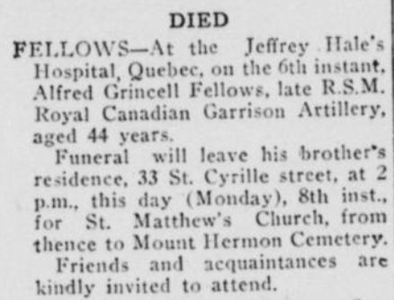
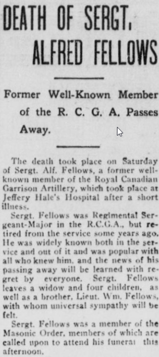
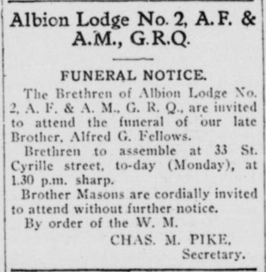
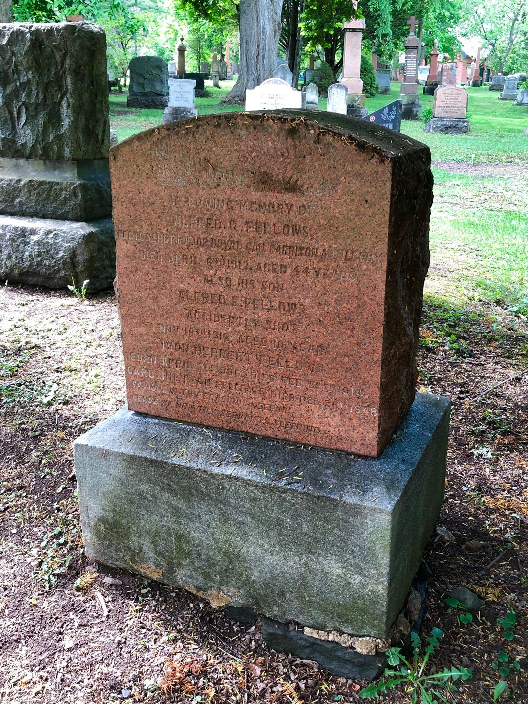
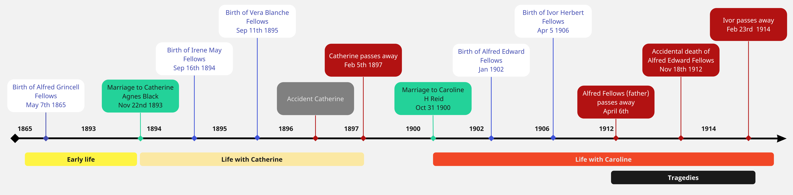

<!-- ENTETE -->
[](https://franc-maconnerie.ca)
[](LICENSE)

---

<div>
    <a target="_blank" href="https://franc-maconnerie.ca">
      
    </a>
</div>

--- 

<!-- FIN ENTETE -->

### **SGM Fr Alfred Grincell Fellows**


||CIVIL DATA|
|---|---|
|Name|[Alfred Grincell Fellows](https://www.ancestry.ca/family-tree/person/tree/197335275/person/332580300467/facts)|
|Date of birth|May 7th 1868|
|Place of birth|Kent, England|
|Father|Joseph Grinsell Fellowes|
|Mother|Mary Anne Fletcher|
|Occupation|Sergeant-Major RCGA|
|Religion|Methodist ([Chalmers Wesley United Church](https://chalmerswesley.org/), Quebe City, QC)|
|Date of death|April 6th 1912|
|Place of death|Québec, QC|
|Age at death|44 y-o|
|Burial site|[Mount Hermon Cemetery](https://www.mounthermoncemetery.com/), Quebec City, QC|

Sergeant-Major RCGA - Royal Canadian Garrison Artillery, 8th Regiment, "B" Battery - Québec City, QC  

Husband of Catherine Agnes Fellows née Black and ( - Feb 5th 1897)    

Catherine Black death Feb 5th 1897 (Friday)    

Service from residence at the Citadel to St Matthew's Church, by Revd Lennox Williams, Revd Mr Scott.    

Burial Mount Hermon Cemetery   Feb 8th 1897 (Monday)   

Still-born child buried Feb 6th 1897 (Saturday)

Their daughter, Irene May Fellows, is sent to be raised by her uncle and aunt, TVF Maj William Grincell Fellows and Mrs Fellows, that live in Montréal at this time. 


Remaried Caroline H Reid (1873 – 1948)   

Alfred Edward Fellows, born about 1902 and buried Nov 20th 1912, at the age of 10 y-o.    
https://www.ancestry.ca/discoveryui-content/view/1086793:1091

Ivor Herbert Fellows, son of Alfred Grincell Fellows, Sergeant-Major R C G A, of Québec, and of his wife Caroline, born the fifth day of April, AD 1906, was baptised on June 18th of the same. Died on the twenty-third and was buried on the twenty-fourth day of February, AD 1914 (7 years old). 


Grave of Alfred Grincell Fellows:   
https://www.findagrave.com/memorial/156652478/alfred_grincell_fellows   



*The Quebec chronicle, Apr 8th  1912*



*The Quebec chronicle, Apr 8th  1912*



*The Quebec chronicle, Apr 8th  1912*


The Quebec chronicle, 1912-04-08, Collections de BAnQ. Alfred G Fellows Obituary.   
https://numerique.banq.qc.ca/patrimoine/details/52327/3609784




### **Ivor Herbert Fellows**    
Ivor Herbert Fellows, son of Alfred Grincell Fellows, Sergeant-Major R C G A, of Québec, and of his wife Caroline, born the fifth day of April, AD 1906, was baptised on June 18th of the same. Died on the twenty-third and was buried on the twenty-fourth day of February, AD 1914 (7 years old).   
Grave:   
https://www.findagrave.com/memorial/156648143/ivor_herbert_fellows


Alfred Edward Fellows, born about 1902 and buried Nov 20th 1912. 
https://www.ancestry.ca/discoveryui-content/view/1086793:1091

## Alfred's sad history

SGM A.G.Fellows was born on May 7th 1865. He married Catherine Agnes Black, age 20 from Québec City, on Nov 22nd 1893, when he was 28 years-old. His first daughter, Irene May, was born on Sept 16th 1894 and the second daughter, Vera Blanche, on Sept 11th the next year. At the end of 1896 Catherine suffered a most unfortunate accident: a horse cart lost control and the reins hit Catherine and a friend that were passing by. She was then expecting a baby; she survived the immediate accident, but passed away at the delivery of the baby, the accident being thought of as a major cause of her passing. The baby also passed away at birth. Curiously, the friend that was with her also passed away, following the accident. Sgt Fellows is left widower and alone, with two baby girls to raise, ohe aged 2 1/2 y-o and the other 1 1/2 years old. So his brother, Sgt Major William Grincell Fellows came to help and took the two babies to take care at his home, aided by his wife Alice.

Three and a half years later, Sgt Major Fellows married Caroline "Carrie" H Reid in Québec. He brings over his daughters to raise them with his new wife, as stated in the 1901 Canadian Census. They were then 6 and 5 years-old. Shortly after, in January 1902 the couple had their first son, Alfred Edward; the other son, Ivor Herbert would be born in April 1906. Everything seemed to be getting back on track to the family. The 1911 Census of Canada shows all of them living together at 22 Lachevrotière Street, in Québec downtown. By this time, Sgt Major Fellows is serving the RCGA, does instruction drills for the garrison, the kids are growing...

But then, fortune turns her face away from them. Sgt Major Fellows passed away on April 5th 1912, following a short disease, leaving a legion of friends, brothers-in-arms and family members in a painful mourning for him. He was one of the most beloved soldiers that ever served in the Artillery Garrison of Québec. The greater grief is with his wife, Caroline, who is left with four children to raise, without the fundamental support of their father.

Once again, seven months later, Hades rears his head towards the family and tragedy strikes. Alfred Edward, Caroline and Alfred's first-born son, dies in a gun accident at the tender age of 10 years. While on a playdate at Allan Fanning's house, a revolver charged goes off while the two boys were manipulating it. The shot fatally wounds Alfred, who dies at the scene. The coroner's investigation confirms it to be a sorrowful accident and no reason to believe in foul play by Allan Fanning.

Caroline is now inconsolable, so soon after losing her husband she now loses her beloved son. The year of 1912 was merciless with Mrs Fellows.

Tragedy struck once again when, 16 months later, Caroline's second son, Ivor, passed away after succumbing to an unknown illness. The loss of another child deeply affected Caroline, and she carried the weight of these unfortunate twists of fate.

However, despite the immense challenges she faced, Caroline continued to live her life with strength and resilience. She persevered and found ways to carry on, even in the face of unimaginable grief. She lived in Québec City until the age of 75, leaving behind a legacy of endurance and determination.

**Timeline**
```
1872 Birth of Catherine Agnes Black 
1893 Marriage to Catherine Agnes Black (Nov 22nd)
1894 Birth Irene May Fellows (Sept 16th)
1895 Birth Vera Blanche Fellows (Sept 11th)
1897 Death of Catherine and stillborn child (Feb 5th - 24 y-o) 
1900 Marriage with Caroline H Reed (Oct 31st)
1902 Birth Alfred Edward Fellows (Jan)
1906 Birth Ivor Herbert Fellows (Apr 5th)
1912 Death SGM Alfred Grincell Fellows (Apr 6th - 44 y-o)
1912 Death of Alfred Edward Fellows (Nov 18th - 10 y-o)
1914 Death of Ivor Herbert Fellows (Feb 23rd - 7 y-o)
1948 Death of Caroline H Reid (Dec 26th)
1958 Death of Irene May Fellows 
1965 Death of Vera Blanche Fellows 
```



# References

Census 1901: https://www.ancestry.ca/discoveryui-content/view/7966890:8826   
Census 1911: https://www.ancestry.ca/discoveryui-content/view/1666571:8947   
Grave: https://www.ancestry.ca/discoveryui-content/view/4031144:60527     
https://www.findagrave.com/memorial/156652478/alfred-grincell-fellows

## Newspaper clippings

The Quebec chronicle, 1914-02-24, Collections de BAnQ.
https://numerique.banq.qc.ca/patrimoine/details/52327/3610366

The Quebec chronicle, 1914-02-25, Collections de BAnQ.
https://numerique.banq.qc.ca/patrimoine/details/52327/3610367

The daily witness, 1912-11-19, Collections de BAnQ.
https://numerique.banq.qc.ca/patrimoine/details/52327/4698841

L'action sociale, 1912-11-19, Collections de BAnQ.
https://numerique.banq.qc.ca/patrimoine/details/52327/2784474

L'action sociale, 1912-11-21, Collections de BAnQ.
https://numerique.banq.qc.ca/patrimoine/details/52327/2783107

The Quebec chronicle, 1912-11-19, Collections de BAnQ.
https://numerique.banq.qc.ca/patrimoine/details/52327/3609975

