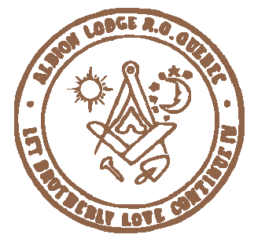
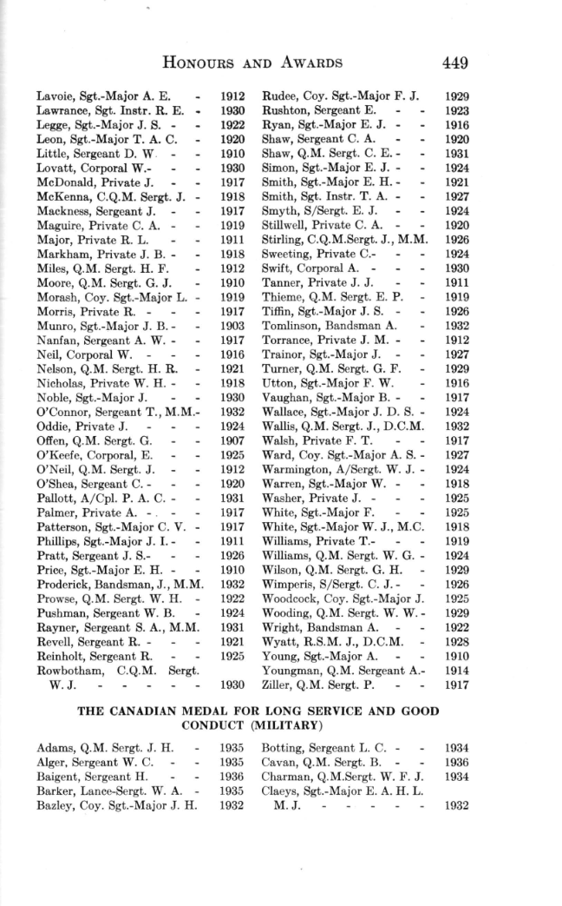
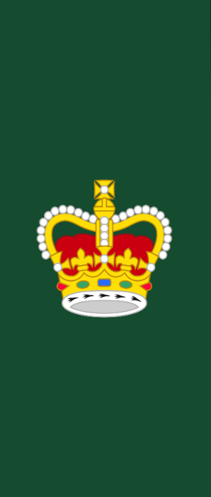
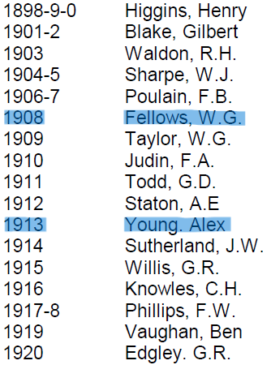
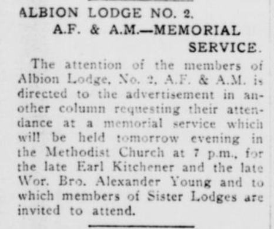
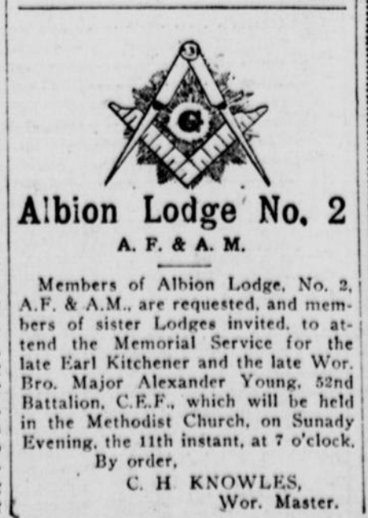
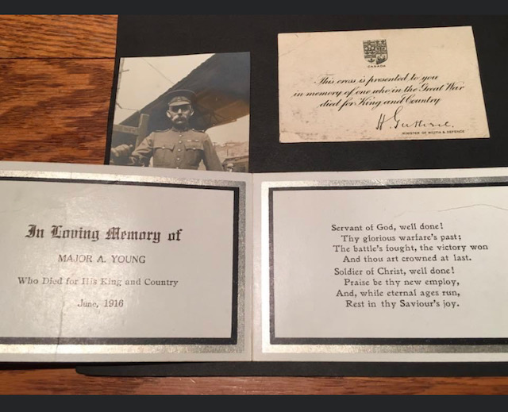

<!-- ENTETE -->

---

    

--- 

<!-- FIN ENTETE -->

# **Maj TVF Alexander Young**

||CIVIL DATA|
|---|---|
|Name|[Alexander Young](https://www.ancestry.ca/family-tree/person/tree/197335275/person/332580257102/facts)|
|Date of birth|Feb 1st 1869|
|Place of birth|Aberdeen, Aberdeenshire, Scotland|
|Father|James Young|
|Mother|Jane Troup|
|Marriage|Oct 11th 1893, Toronto|
|Spouse|Annie Buxton Young, née Gardiner|
|Occupation|Soldier|
|Religion|Methodist|
|Date of death|June 3rd 1916, killed in action|
|Place of death|[Battle of Sactuary Wood](https://www.veterans.gc.ca/eng/remembrance/memorials/hill-62)    |
|Age at death|47 years-old|
|Burial site|MENIN GATE (YPRES) MEMORIAL, Belgium, Grave ref: Panel 24 - 26 - 28 - 30  |

## Military carreer

Joined the Militia: 1891
Private Infantry School, York County

Colour Sergeant RCR

Promoted Major June 1915, before enlisting for active duty

Awarded The Long Service and Good Conduct Medal, 1910 

Source : The Royal Canadian Regiment, 1883-1933, Robert Collier Fetherstonhaugh, p. 449

### **Colour-Sergeant** 

It is the senior NCO of a Coy; it is a rank equivalent to warrant officer. He wears the rank insignia of a warrant officer 
(a royal crown) on all uniforms, except on No.1 Cerimonial Dress, on which a special rank badge is worn: three chevrons, 
pointing down, surmonted by an image of the regimental Colours. The rank was introduced by the British Army Infantry 
Regiments in 1813 during the Napoleonic Wars to reward long serving sergeants. 

Source: https://www.canadiansoldiers.com/ranks/tableofranksandresponsibilities.htm

**Insignia of Colour-Sergeant**

Source: https://www.canadiansoldiers.com/ranks/tableofranksandresponsibilities.htm

## South African War (Boer War)

Rank: Colour Sergeant; Lieutenant   
Force: Militia   
Unit: Royal Canadian Regiment (RCR)   

2nd (Special Service) Battalion, Royal Canadian Regiment, 

"E" Coy Recruited in Montréal, PQ

"E" Coy Colour-Sargeant A. Young 

Embarked to South Africa October 30th 1899 in Quebec City, on the Allan Line S.S. Sardinian. 

There were two stowaways on the ship, that upon discovery were taken on strength on the force. 

[Land Grant Application](https://www.bac-lac.gc.ca/eng/discover/military-heritage/south-african-war-1899-1902/Pages/item.aspx?IdNumber=7346&) Library and Archives Canada - must be ordered a copy

**Refs:**

[South African War, 1899-1902 - Service Files, Medals and Land Applications](https://www.bac-lac.gc.ca/eng/discover/military-heritage/south-african-war-1899-1902/Pages/service-files-south-african-war.aspx#g) - Library and Archives Canada

## First World War 

Rank: Major  
Force: Army   
Unit: Canadian Infantry (Manitoba Regiment)   
Division: 52nd Overseas Battalion  
Enlistment Date:	1915-10-31  
Next of kin: 
Place of Enlistment:	Port Arthur ON Canada  
Reference:	RG 150, Accession 1992-93/166, Box 10642 - 49  
Item Number:	330729  
Record Group:	Canadian Expeditionary Force (CEF)  
Service Number (regimental): No service numbers for officers     
Died: 1916-06-03 Killed in action    
Battle killed: [Battle of Sactuary Wood](https://www.veterans.gc.ca/eng/remembrance/memorials/hill-62)    
Buried: MENIN GATE (YPRES) MEMORIAL, Belgium, Grave ref: Panel 24 - 26 - 28 - 30
 
Decorations: Long Service and Good Conduct Medal   

Son of the late Robert Young, of Aberdeen, Scotland; husband of Annie Buxton Young née Gardiner (formerly Young), of 89, Lockwell Avenue, Quebec.   
Twenty-four years with the Royal Canadian Regt. in Toronto and Quebec. Served in the South African Campaign. Father of Florence May Young and Charles Alexander Young.   

From the service file (p. 51): 

        RECORD OF SERVICE
    CANADIAN EXPEDITIONARY FORCE 

    Major Alexander Young. (Deceased).

    1. Date and place of birth: 1-2-69, Aberdeen, Scotland. 
    2. Appointed Lieutenant & Adjutant, 52nd Battalion, C.E.F. 4-5-15
    3. Promoted Captain, 11-5-15
    4. Appointed Major, 18-7-15
    5. Embarked for England, 23-11-15
    6. Proceeded to France, 21-2-16, with Unit. 
    7. Killed in action, 3-6-16

        CERTIFIED CORRECT 
           FROM RECORDS 

                                  (W.E.L Coleman), Major
                                  Officer i/c Records, 
                                  for Adjutant-General. 

La Patrie, 8 juin 1916, jeudi

      UN QUEBECOIS TUE, UN AUTRE BLESSE 

      LA MAJOR YOUNG EST MORT AU CHAMP D'HONNEUR, LE LT-COL HAY EST BLESSE 

      (Dépêche spéciale à la PATRIE)

      QUEBEC, 8 - Sur la liste des pertes canadiennes publiées ce matin apparaît le nom d'un autre 
      officier Québecois tué au front: c'est celui du major A. Young. Le major Young était très 
      populaire dans le cercle de la milice à Québec: Il vint à Québec voilà plusieurs années 
      comme sergent-instructeur: il avait pris du service dans un régiment de Port-Arthur afin de 
      partir pour la guerre. C'est là qu'il fût promu major après avoir obtenu ses autres grades à 
      Québec: il a fait la campagne d'Afrique et a été décoré de la medaille du couronnement du Roi. 
      Il laisse une femme, un fils et une fille qui sont à Québec. 

      Quand il obtint sa commission de lieutenant dans la 5e brigade, il servait sous les ordres du 
      lientenant A. Hay, dont le nom ce matin apparait sur la liste de blessés. Ce dernier, au premier 
      camp de Valcartier était commandant en second du 2e batallion qui était alors commandé par le 
      général D. Watson. 

## Masonic Life 

Member of Albion Lodge, #2. Right Worshipful Brother Alexander Young was the Worshipful Master of the Lodge for the year of 1913, shortly before deploying to the European theatre on First World War, where he would pay the ultimate sacrifice for his country.

## Obituaries

**Obituary and notice to Albion's members to attend the memorial service of the late W Bro Alexander Young. Source: Quebec Chronicle, June 10th 1916.**

      Albion Lodge No. 2 
      A.F.& A.M.

      Members of Albion Lodge, No. 2, A.F. & A.M., are requested, and members of sister Lodges invited, 
      to attend Memorial Service for the late Earl Kitchener and the late Wor. Bro. Major Alexander Young, 
      52nd battalion, C.E.F., which will be held in the Methodist Church, on Sunday Evening, the 11th 
      instant, at 7 o'clock.
          By order, 
             C. H. KNOWLES, 
                Wor. Master.

**Circumstance of death:**    
as written in letters to the family by Major Young's brothers-in-arms who were eye witness of his death, his grand-daughter tells us of the circumstances of his death:

*"His men saw him go into a fox hole and then the explosion from the bomb that followed him in. It was very heavy fighting and by the time they could go back to look for him, there was nothing to be found."*

As his body could never be retrieved, there is no grave with his remains to be visited. The Commonwealth War Graves Commission has a [memorial](https://www.cwgc.org/find-records/find-war-dead/casualty-details/1597253/alexander-young/) for him at the [Menin Gate Memorial](https://www.cwgc.org/visit-us/find-cemeteries-memorials/cemetery-details/91800/ypres-menin-gate-memorial/), in Ypres, Belgium. 

However, in Mount Hermon Cemetery, Quebec City, there is a memorial to Major Young in his beloved wife's headstone, where his memory can be cherished near his home. 

**Alexander Young's commemorative headstone in Mount Hermon Cemetery, Quebec. Source: family photo.**

**Monument 52nd (New Ontario) Battalion, Canadin Expeditionary Force**
[Google Maps](https://maps.app.goo.gl/r9rtzu6qTUV5i5Nn7?g_st=ic)

**Memorial card commemorating Maj Alexander Young's death, sent by the Canadian government to the family. Source: family photo.**

## References 

Service File - Library and Archives Canada    
https://www.bac-lac.gc.ca/eng/discover/military-heritage/first-world-war/personnel-records/Pages/item.aspx?IdNumber=330729

Commonwealth War Graves Commission     
https://www.cwgc.org/find-records/find-war-dead/casualty-details/1597253/alexander-young/

Canadian Fallen    
https://canadianfallen.ca/9875/YOUNG

Canadian Virtual War Memorial  
https://www.veterans.gc.ca/eng/remembrance/memorials/canadian-virtual-war-memorial/detail/1597253?Alexander%20Young
 
Canadian Great War Project   
https://canadiangreatwarproject.com/person.php?pid=60436

### Newspaper clippings

Quebec Chronicle, 8 juin 1916, Perfil Maj Alexander  
https://numerique.banq.qc.ca/patrimoine/details/52327/3611081?docsearchtext=alexander

Quebec Chronicle, 10 juin 1916,Demande Albion de presença ao servico religioso  
https://numerique.banq.qc.ca/patrimoine/details/52327/3611083?docsearchtext=alexander

