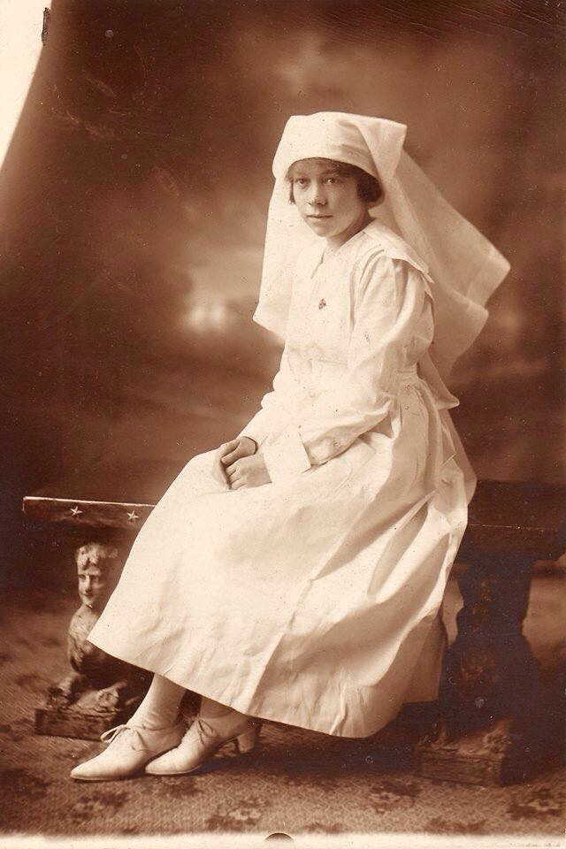

<!-- ENTETE -->

---

    

--- 

<!-- FIN ENTETE -->

# **Nursing Sister Lieut. Irene May Young née Fellows**
Irene May Fellows (Imperial War Museum - Lives of the First World War)    

Daughter of **Alfred Grincell Fellows** and **Catherine Agnes Fellows** (nee Black); wife of **Charles Alexander Young** (Service No. 22822)
Date of birth: Sept 16th 1894   
Place of birth: Quebec, PQ   
Next of kin: Major William Grincell Fellows, uncle. 243 Fairmount Avenue, Montreal, Quebec   
Occupation (attested): Trained Nurse    
Address: 61 St. Cyrille Street, Quebec, Quebec    
Religion: Church of England    
Date of death: 1958-12-05    
Buried: St. Catharines (Victoria Lawn) Cemetery    
Service: Canadian Expeditionary Force    	  
Unit: Canadian Army Medical Corps 	 
Rank: Nursing Sister (Lieutenant)	  
Service File:  [B3029-S033](https://central.bac-lac.gc.ca/.item/?op=pdf&app=CEF&id=B3029-S033)     
IWM: https://livesofthefirstworldwar.iwm.org.uk/lifestory/5857947    
Great War Project: https://canadiangreatwarproject.com/person.php?pid=87189