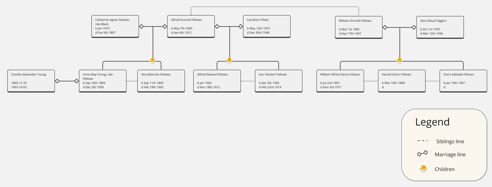
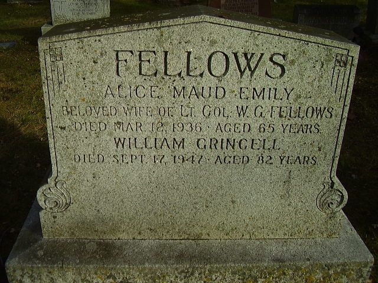

<!-- ENTETE -->

---

    

--- 

<!-- FIN ENTETE -->

### **Maj TVF William Grincell Fellows** 

||CIVIL DATA|
|---|---|
|Name|[William Grincell Fellows](https://www.ancestry.ca/family-tree/person/tree/197335275/person/332580303118/facts)|
|Date of birth|Mar 1st 1865|
|Place of birth|Limerick, Ireland|
|Father||
|Mother||
|Spouse| Alice Maud Emily Higgins| 
|Next of kin||
|Occupation|Military, Major, Royal Canadian Artillery|
|Religion||
|Date of death|Sept 17th 1947|
|Place of death|Montreal, Qc|
|Age at death|82 years|
|Burial site|Les Jardins Commémoratifs Lakeview Memorial Gardens (Pointe-Claire), Montréal, Quebec|

B Battery Québec, RCA Royal Canadian Artillery  
Wife: Alice Maud Emily Higgins d Mar 12th 1936 (65 y-o)  
Daughter: Doris Adelade Fellows b Jan 14th 1907 bp Jan 19th 1907  

In ranks 19yrs 8 mths   
WO 3 yrs 8 mths 16 dys   
Lt (DO) RCA - Dec 2nd 1907   
Capt RCA - Dec 2nd 1912   

      APPOINTMENTS, PROMOTIONS AND RETIREMENTS.    
      CANADIAN MILITIA.    
      1908.    
      HEADQUARTERS, OTTAWA, 7th January, 1908.    

      The following appointments, promotions, retirements, and confirmations of ranks are 
      promulgated to the Militia by the Honourable Minister of Militia and Defence in Militia Council. 

      (...)

      PERMANENT FORCE.

      THE ROYAL CANADIAN ARTILLERY - To the Lieutenant (District Officer) : Warrant Officer (Master Gunner) 
      William Grincell Fellows, The Royal Canadian Artillery, to complete establishment. 2nd December, 1907. 

------

      NOMINATIONS, PROMOTIONS    
      ET RETRAITES.    
      MILICE CANADIENNE.    
      1908.    
      QUARTIER GÉNÉRAL.    
      OTTAWA, 7 janvier 1908.   

      Les nominations, promotions, retraites et confirmations de grade qui suivent sont promulguées pour 
      l'usage de la milice par l'honorable Ministre de la Milice et de la Défense en conseil de la milice. 

      (...) 

      TROUPES PERMANENTES. 

      ARTILLERIE ROYALE CANADIENNE - Est nommé lieutenant (officier de district): l'officier breveté (maître 
      cannonier) William Grincell Fellows, de l'artillerie royale canadienne, pour compléter l'effectif. 2 décembre 1907. 

**Source: The Canada Gazette. Jan 4th, 1908. Promotions William Grincell Fellows**

In ranks 19 yrs 8 mths

WO 3 yrs 8 mths 16 dys 

Lt (DO) RCA 2 Dec 1907

Capt  RCA 2 Dec 1912

*Canadiana Govt Records*

# Masonic Life

In the Masonic Order he has had the distinction of being Past-Master of the two oldest lodges in Canada, Antiquity No.1 of Montreal and Albion No.2, of Quebec, both of which are under the Grand Registry of Quebec. In addition he has been honoured by his brethren in the Order by being elected to the important position of District Grand Master of Quebec and Three Rivers.

- Worshipful Master of The Lodge of Antiquity, #1, Montréal, Québec, year 1899. 

- Worshipful Master of Albion Lodge #2, Québec, Québec, year 1908. 

Sources:    
Albion Roll Call.     
The Quebec chronicle, 1918-09-27.   
Antiquity Lodge 2 books.

# Obituary

**Source: La Presse, 19 sept 1947**

## Headstone 

Les Jardins Commémoratifs Lakeview Memorial Gardens (Pointe-Claire), Montréal, Quebec

https://canadianheadstones.ca/wp/headstone-vendor/?wpda_search_column_idperson=1410654

# References 

LAC - Personnel Records of the First World War

https://www.bac-lac.gc.ca/eng/discover/military-heritage/first-world-war/personnel-records/Pages/item.aspx?IdNumber=381660

Canadian Great War Project

https://canadiangreatwarproject.com/person.php?pid=962599

## Newspapers clippings 

The Canada Gazette. Ottawa, Saturday, Jan 4th, 1908. Promotions William Grincell Fellows.    
https://books.google.ca/books?id=ICU-AQAAMAAJ&lpg=PA1923&ots=fSxzPNBJfE&dq=%22william%20grincell%20fellows%22&hl=pt-BR&pg=PA1701#v=onepage&q&f=false

The Quebec chronicle, 1918-09-27, Collections de BAnQ. Departure of a popular officer. 
https://numerique.banq.qc.ca/patrimoine/details/52327/3611812?docsearchtext=william%20fellows

La presse, 1947-09-19, Collections de BAnQ. Obituaire de William Gincell Fellows.    
https://numerique.banq.qc.ca/patrimoine/details/52327/2959538?docsearchtext=grincell%20fellows

