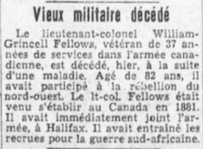

<!-- ENTETE -->

---

    

--- 

<!-- FIN ENTETE -->

### **Maj TVF William Grincell Fellows** 

||CIVIL DATA|
|---|---|
|Name|William Grincell Fellows|
|Date of birth|Mar 1st 1865|
|Place of birth|England|
|Father||
|Mother||
|Next of kin||
|Occupation|Military, Major, Royal Canadian Artillery|
|Religion||
|Date of death|Sept 17th 1947|
|Place of death|Montreal, Qc|
|Age at death|82 years|
|Burial site||

B Battery Québec, RCA Royal Canadian Artillery  
Wife: Alice Maud Emily Higgins 

In ranks 19yrs 8 mths   
WO 3 yrs 8 mths 16 dys   
Lt (DO) RCA - Dec 2nd 1907   
Capt RCA - Dec 2nd 1912   

https://canadianheadstones.ca/wp/headstone-vendor/?wpda_search_column_idperson=1410654

      APPOINTMENTS, PROMOTIONS AND RETIREMENTS.    
      CANADIAN MILITIA.    
      1908.    
      HEADQUARTERS, OTTAWA, 7th January, 1908.    

      The following appointments, promotions, retirements, and confirmations of ranks are 
      promulgated to the Militia by the Honourable Minister of Militia and Defence in Militia Council. 

      (...)

      PERMANENT FORCE.

      THE ROYAL CANADIAN ARTILLERY - To the Lieutenant (District Officer) : Warrant Officer (Master Gunner) 
      William Grincell Fellows, The Royal Canadian Artillery, to complete establishment. 2nd December, 1907. 

------

      NOMINATIONS, PROMOTIONS    
      ET RETRAITES.    
      MILICE CANADIENNE.    
      1908.    
      QUARTIER GÉNÉRAL.    
      OTTAWA, 7 janvier 1908.   

      Les nominations, promotions, retraites et confirmations de grade qui suivent sont promulguées pour 
      l'usage de la milice par l'honorable Ministre de la Milice et de la Défense en conseil de la milice. 

      (...) 

      TROUPES PERMANENTES. 

      ARTILLERIE ROYALE CANADIENNE - Est nommé lieutenant (officier de district): l'officier breveté (maître 
      cannonier) William Grincell Fellows, de l'artillerie royale canadienne, pour compléter l'effectif. 2 décembre 1907. 

The Canada Gazette. Ottawa, Saturday, Jan 4th, 1908. Promotions William Grincell Fellows.    
https://books.google.ca/books?id=ICU-AQAAMAAJ&lpg=PA1923&ots=fSxzPNBJfE&dq=%22william%20grincell%20fellows%22&hl=pt-BR&pg=PA1701#v=onepage&q&f=false

La presse, 1947-09-19, Collections de BAnQ. Obituaire de William Gincell Fellows.    
https://numerique.banq.qc.ca/patrimoine/details/52327/2959538?docsearchtext=grincell%20fellows
