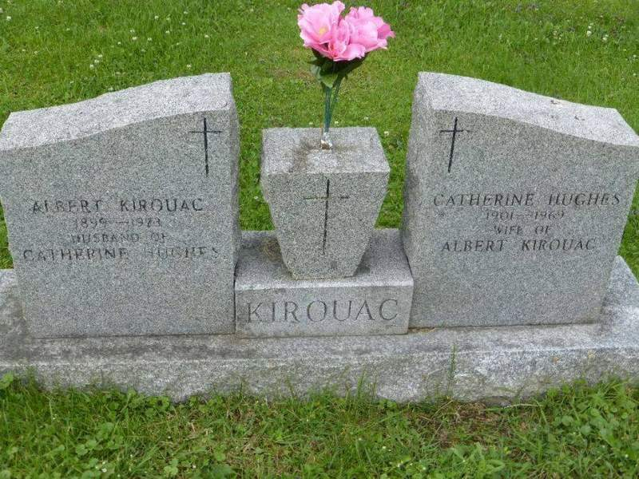

<!-- ENTETE -->

---

    

--- 

<!-- FIN ENTETE -->

# Sergeant-Major Albert Kirouac 

1st Battalion RRC 

Warrant Officer Class II 

DOB: 1899-12-23

Maried to Catherine Victoria Hughes (1901-1969)

Enlistment Region: Eastern Quebec 

Regimental Number: E22849 

Company Sergeant Major - A Coy 

Date Wounded: 1941-12-25

POW Camps

North Point  - 1941-12-30 to 1942-09-29
Sham Shui Po - 1942-09-26 to 1945-09-10

Transport from South East Asia to home: 

USS Admiral CF Hughes 
Arrival Victoria, BC, in 1945-10-09

After War worked on a paper mill in Kenogami, QC. 

Date of death: 1973-01-25
Cemetery Location: Ste-Famille Cemetery, Kenogami, QC. 

## References 

Le Soleil Saguenay-Lac-St-Jean, samedi, 27 janvier 1973. BAnQ. 

HKVCA Veteran Profile:    
https://www.hkvca.ca/cforcedata/indivreport/indivdetailed.php?regtno=E22849 

HKVCA Vault for Albert Kirouac   
https://drive.google.com/drive/folders/17lElQiLeEhWjT1QwQLgLVbIFqnrN09Jf