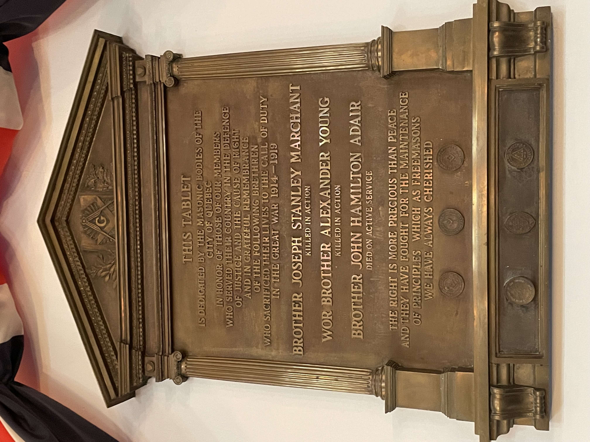

<!-- ENTETE -->
[](https://franc-maconnerie.ca)
[](LICENSE)

---

<div>
    <a target="_blank" href="https://franc-maconnerie.ca">
      
    </a>
</div>

--- 

<!-- FIN ENTETE -->

# Albion, loja militar

**Título provisório:** *Albion, loja militar* 

**Plano geográfico:** Cidade de Québec

**Timeframe:** a partir de 1752

**Público alvo:** público maçônico interno, todos os graus. Possívelmente apresentar como presente para a loja na soirée militaire.

**Idioma primário:** francês

**Fontes de pesquisa:** atas da loja Albion; atas em possessão do 4th Btn Royal Regiment Artillery; bibliografia maçônica; sites de potências envolvidas (UGLE; GL Atholl); arquivos PDF recuperados das bibliotecas virtuais; registros de serviço militares canadenses e dos aliados. 

## Questões para pesquisa

- Descrever a história da Albion:
  - warrant militar e ambulante pela GL Antients;
  - fundação em NY;
  - retirada com exército Britânico;
  - Newfoundland;
  - Woolwich;
  - Québec;
  - compra da charte n. 9;
  - estabelecimento de charte civil e sedentária;
  - mostrar o processo de adesão à UGLE, e posteriormente à GLQ
- Albion hoje:
  - orgulhosa raízes militares;
  - homenagem aos membros que foram perdidos nas guerras do Canada;
  - muitos membros são ou foram das Forces; estatística
  - descrever a soirée militaire anual com banquete
- breve biografia dos irmãos da Albion caídos nas guerras
  - vida civil: origem, cidade, profissão, família imediata
  - registro militar: patente, onde serviu, circunstância da morte, registro do local de repouso.
  - sobre vida maçônica:
    - grau,
    - iniciação,
    - outras notas em ata;
    - registro sobre a morte
    
    <br />
*Plaque commemorative des frères d'Albion tombés dans la Première Guerre Mondiale*[^hero]

[^hero]: Masons honor craft heroes, Quebec Telegraph, p. 4, 22/11/1921   
  https://books.google.ca/books?id=gpYfAAAAIBAJ&printsec=frontcover&hl=pt-BR#v=snippet&q=heroes&f=false


## Biografias 

## Fr Joseph Stanley Marchant   
**Rank:** Lance Corporal   
**Born:** August 18, 1890  
**Service Number:** 22900   
**Force:** Army   
**Unit:** Canadian Infantry (Eastern Ontario Regiment) Canadian Expeditionary Force    
**Division:** 2nd Btn   
**Decoration:** Cross of the Order of Saint George, 4th Class    
**Profession:** Agent de douane    
**Passed:** May 08, 1915 Age: 24      
**Buried:** BOULOGNE EASTERN CEMETERY, Pas de Calais, France   
**Grave reference:** VIII. C. 9.   
**Veteran's reference:**  RG 150, Accession 1992-93/166, Box 5915 - 11   
**Item number:** 197849   
**Record Group:**  Canadian Expeditionary Force (CEF)   
**Service File:** [B5915-S011](http://central.bac-lac.gc.ca/.item/?op=pdf&app=CEF&id=B5915-S011)   

**Decoration:** Cross of the Order of Saint George, 4th Class   
             Citation: THE EDINBURGH GAZETTE, AUGUST 27, 1915, pp. 1312-1314   
https://www.thegazette.co.uk/Edinburgh/issue/12845/page/1314/data.pdf   
https://www.thegazette.co.uk/Edinburgh/issue/12845/page/1314/data.pdf

https://www.veterans.gc.ca/eng/remembrance/memorials/canadian-virtual-war-memorial/detail/168067?Joseph%20Stanley%20Marchant

https://www.veterans.gc.ca/eng/remembrance/memorials/canadian-virtual-war-memorial/detail/168067

https://astreetnearyou.org/person/168067/Lance-Corporal--Marchant

https://livesofthefirstworldwar.iwm.org.uk/lifestory/5674161

https://www.everyoneremembered.org/profiles/soldier/168067/

https://www.bac-lac.gc.ca/eng/discover/military-heritage/first-world-war/personnel-records/Pages/item.aspx?IdNumber=197849

https://canadiangreatwarproject.com/person.php?pid=8129

https://www.cwgc.org/find-records/find-war-dead/casualty-details/168067/j-s-marchant/

Sherbrooke daily record, 1915-05-29, Collections de BAnQ.  
https://numerique.banq.qc.ca/patrimoine/details/52327/3101785?docsearchtext=joseph%20stanley%20marchant

**Decoration:** Cross of the Order of Saint George, 4th Class   
             Citation: THE EDINBURGH GAZETTE, AUGUST 27, 1915, pp. 1312-1314   
https://www.thegazette.co.uk/Edinburgh/issue/12845/page/1314/data.pdf   
https://www.thegazette.co.uk/Edinburgh/issue/12845/page/1314/data.pdf


See 'Ribbons and Medals', by H Taprell Dorling:

The Order of St. George...was awarded only for conspicuous bravery in action against the enemy...

Over two million Crosses and Medals of St. George were distributed to soldiers, sisters of mercy, and members of Red Cross institutions and hospitals during the First World War...

The Order of St. George was essentially military, and could never be conferred upon civilians except for services actually under fire...

The black and orange ribbon of this Order meant **'through Darkness to Light,'** ...

https://www.greatwarforum.org/topic/213631-st-george-cross-4th-class/


## TVFr Major Alexander Young

Pour la biografie du TVF Maj Alexander Young, merci de consulter la page suivante: [TVFr Major Alexander Young](./4emeSoldat/ayoung.md)


## Fr Maj Hamilton John Adair 

  *"Death is swallowed up in Victory"*

Major
Fullname: HAMILTON JOHN (H J) ADAIR.   
Date of Birth: 22 November 1873.   
Place of Birth: Quebec City, Quebec, Canada.   
Enlisted: 24 August 1917 in Ottawa, Ontario, CA. Age: 43 years   
Rank: Major and Quartermaster.   
Unit: Canadian Army Medical Corps. No. 3 Canadian General Hospital.      
Date of Death: 13 December 1918.   
Incident: Died of illness (uremia).   
Buried: December 13th 1918   
Age at Death: 45 years.     
Cemetery: TERLINCTHUN BRITISH CEMETERY.   
Grave Reference: XII. C. 37.    

Husband of Emily Adair (née Eley), of 61, Blackburn Ave., Ottawa.   
Born at Quebec, P.Q. A member of the Permanent Force (Army Medical Corps). Left behind his wife and their four daughters: Bernie, Doris, Edith & Marjorie.

Fait curieux: Maj Adair a servi avec le Lt-Col John McCrae, dans la même unité No. 3 Canadian General Hospital et ont travaillé ensemble près d'Ypres.  Lt-Col McCrae est l'auteur deu poème `In Flanders Fields`. 


https://canadianfallen.ca/profile.php?id=64145

https://www.veterans.gc.ca/eng/remembrance/memorials/canadian-virtual-war-memorial/detail/4024257

Imperial War Museum  
https://livesofthefirstworldwar.iwm.org.uk/lifestory/5535125

First World War Book of Remembrance  
https://www.veterans.gc.ca/eng/remembrance/memorials/books/page?page=357&book=1&sort=pageAsc

https://astreetnearyou.org/person/4024257/Major-Hamilton-John-Adair

https://canadiangreatwarproject.com/search.php?cod=Died%20of%20illness&pob=QUEBEC&col=nam,pob,dob,hocc,cod,rgm,rnk,rgn

https://www.bac-lac.gc.ca/eng/discover/military-heritage/first-world-war/personnel-records/Pages/item.aspx?IdNumber=952

https://www.cwgc.org/find-records/find-war-dead/casualty-details/4024257/hamilton-john-adair/

https://www.veterans.gc.ca/eng/remembrance/memorials/books/page?page=357&book=1

https://public.cdn.cloud.veterans.gc.ca/images/remembrance/memorials/books/bww1/high-res/ww1357-hr.jpg

https://www.everyoneremembered.org/profiles/soldier/4024257/

https://www.findagrave.com/memorial/55974012/hamilton_john-adair/photo

https://www.findagrave.com/memorial/55974012/hamilton_john-adair/photo#source

Fetherstonhaugh, R.C., No. 3 Canadian General Hospital (McGill), Montreal, the Gazette Printing Company, 1928, Collections de BAnQ.    
(Information about burial)   
https://numerique.banq.qc.ca/patrimoine/details/52327/2561487?docref=jyvm7GBZHfYTLlkxYSmn7w


The Quebec chronicle, 1919-04-08, Collections de BAnQ. Hamilton John Adair.
https://numerique.banq.qc.ca/patrimoine/details/52327/3611977?docsearchtext=Hamilton%20John%20Adair


## Bibliografia 

*Graham, John H.* **Outlines of the History of Freemasonry in the Province of Quebec.** 1st ed. Montréal: John Lovell & Son, 1892. p 489-490.   
[https://www.google.ca/books/edition/Outlines_of_the_History_of_Freemasonry_i/ZrJJAAAAMAAJ?hl=pt-](https://www.google.ca/books/edition/Outlines_of_the_History_of_Freemasonry_i/ZrJJAAAAMAAJ?hl=pt-BR&gbpv=1&dq=minute+book+woolwich+9+january+1789&pg=PA489&printsec=frontcover )

**By-Laws The Lodge of Antiquity, No 1, G.R.Q.** Montréal: [s.n.], 1906. 

*Smith, Pemberton.* **A Research into Early Canadian Masonry 1759-1869.** 1st ed.Montréal: Quality Press, 1939. 

*Milborne, Alfred John Bidder.* **Freemasonry in the Province of Quebec.** 1st ed. Knowlton(QC): [s.n.], 1960. 

*Hamon, É.*, **La franc-maçonnerie dans la province de Québec en 1883**, Québec (Province), s.n., 1883, 276 p. ; 19 cm, Collections de BAnQ. 
https://numerique.banq.qc.ca/patrimoine/details/52327/2021763 


*Duncan, Capt. Francis.* **History of the Royal Regiment of Artillery: Compiled from the original records.** London: John Murray Ed, 1872.
VOL I: https://www.gutenberg.org/files/52258/52258-h/52258-h.htm#Page_251    
VOL II: https://www.gutenberg.org/cache/epub/58209/pg58209-images.html

La franc-maçonnerie sous le régime français - État de la question   
Roger Le Moine, S.R.C.   
Les Cahiers des dix, Numéro 44, 1989   
https://www.erudit.org/fr/revues/cdd/1989-n44-cdd0568/1015558ar.pdf
	
Francs-maçons francophones du temps de la «Province of Quebec» (1763-1791)   
Roger Le Moine, S.R.C.   
Les Cahiers des dix, Numéro 48, 1993   
https://www.erudit.org/fr/revues/cdd/1993-n48-cdd0572/1015604ar.pdf


Marrying a Redcoat: Women's Experiences of Marriage in the British Garrison of Quebec City, 1763-1820   
https://qspace.library.queensu.ca/items/2e97ac9c-2d74-4066-84e4-22b26b9cab82


### Web 

Lane's Masonic Record: is an authoritative listing of all the lodges established by the English Grand Lodges from the foundation of the first Grand Lodge in 1717 up until 1894. 
https://www.dhi.ac.uk/lane/

Atholl Lodge List - Antients  
https://antients.org 

Quebec Chronicle, 22 nov 1921 Inauguração da placa na loja Albion
https://books.google.ca/books?id=gpYfAAAAIBAJ&printsec=frontcover&hl=pt-BR&source=gbs_ge_summary_r&cad=0#v=onepage&q=heroes&f=false


## Poem 

```
In Flanders fields 

In Flanders fields the poppies blow
Between the crosses, row on row,
That mark our place; and in the sky
The larks, still bravely singing, fly
Scarce heard amid the guns below.

We are the Dead. Short days ago
We lived, felt dawn, saw sunset glow,
Loved, and were loved, and now we lie
In Flanders Fields.

Take up our quarrel with the foe:
To you from failing hands we throw
The torch; be yours to hold it high.
If ye break faith with us who die
We shall not sleep, though poppies grow
In Flanders Fields.

                    - Lt-Col John McCrae
```
