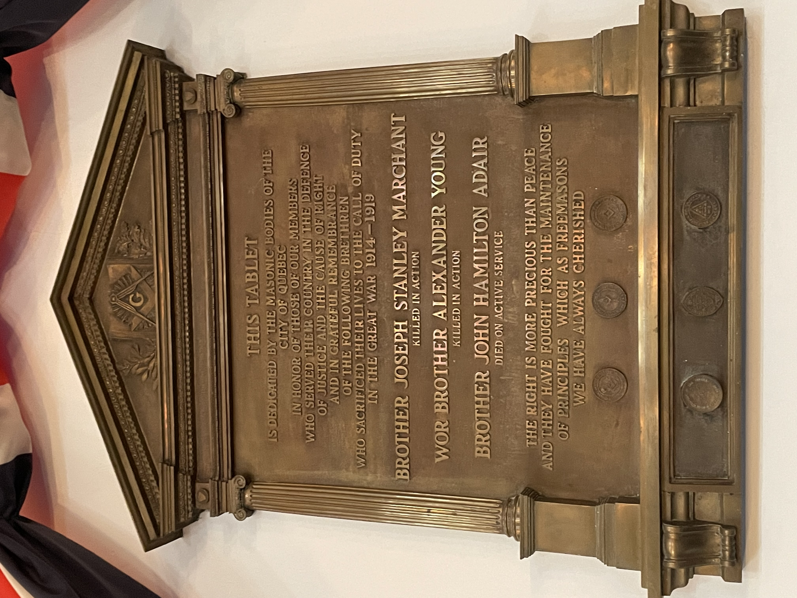

<!-- ENTETE -->
[](https://franc-maconnerie.ca)
[](LICENSE)

---

<div>
    <a target="_blank" href="https://franc-maconnerie.ca">
      
    </a>
</div>

--- 

<!-- FIN ENTETE -->

# Albion, loge militaire

**Titre provisoire:** *Albion, loge militaire* 

**Plan geographique:** Ville de Québec

**Timeframe:** à partir de 1752

**Publique cible:** publique maçonnique, tous les degrés. Presentation probable lors d'une soirée militaire. Publication dans revue de loge de recherches maçonniques.

**Langue primaire:** français.

**Sources de la recherche:** procès-verbaux de la loge Albion; procès-verbaux en possession du 4th Btn Royal Regiment of Artillery; bibliographie maçonnique; site d'obédiences maçonniques impliquées (UGLE; GL Atholl); fichiers PDF recupéres d'archives et de bibliothèques virtuelles; données du service militaire des canadiens et des alliés. 

# Plan de recherche

- Décrire l'histoire d'Albion: 
    - warrant militaire et ambulant par la GL des Antients (Athol); 
    - constitution à NY, sous les auspices de la GL of NY; 
    - retrait avec la British Army des US;
    - Newfoundland;
    - Woolwich;
    - Québec; 
    - achat de la charte No. 9; 
    - rénouvellement par une warrant civile et sédentaire; 
    - montrer le processus d'adhésion à l'UGLE, et ensuite à la GLQ
    
- Albion aujourd'hui:
    - fière de ses racines militaires;
    - hommage aux frères qui ont tombé dans la Grande Guerre;
    - beaucoup parmi les membres ont été militaires ou le sont enconre:
        - statistiques actuelles (année 2024)
    - décrire la soirée militaire annuelle. 

- Breve biographie des frères d'Albion tombés dans la Grande Guerre:
    - Sur la vie civile: origine, ville, profession, famille proche;
    - Sue le registre militaire: rang, où il a servi, circumstances du décès, l'endroit d'inhumation.
    - Sur la vie maçonnique:
        - date d'initiation;
        - dégrés connus;
        - événements notés dans les procès-verbaux de la loge;
        - registre sur le décès du frère.

## Biographies des frères tombés à la Grande Guerre



*Plaque commemorative des frères d'Albion tombés dans la Première Guerre Mondiale*[^hero]


[Fr Joseph Stanley Marchant](./josephStanleyMarchant.md) - Killed in action

[TVFr Alexander Young](https://github.com/torjc01/4eSoldat/blob/prod/ayoung.md) - Killed in action

[Fr Hamilton John Adair](./hamiltonJohnAdair.md) - Died on active service

## Poème 

```
In Flanders fields 

In Flanders fields the poppies blow
Between the crosses, row on row,
That mark our place; and in the sky
The larks, still bravely singing, fly
Scarce heard amid the guns below.

We are the Dead. Short days ago
We lived, felt dawn, saw sunset glow,
Loved, and were loved, and now we lie
In Flanders Fields.

Take up our quarrel with the foe:
To you from failing hands we throw
The torch; be yours to hold it high.
If ye break faith with us who die
We shall not sleep, though poppies grow
In Flanders Fields.

                    - Lt-Col John McCrae
```
## References

Royal Artillery Museum and Archives
https://royalartillerymuseum.com

## Footnotes

[^hero]: Masons honor craft heroes, Quebec Telegraph, p. 4, 22/11/1921   
  https://books.google.ca/books?id=gpYfAAAAIBAJ&printsec=frontcover&hl=pt-BR#v=snippet&q=heroes&f=false
