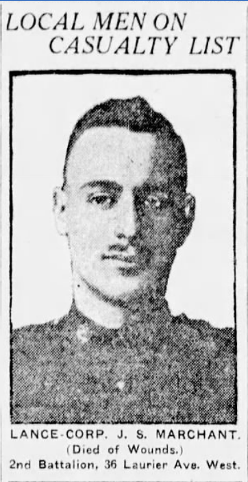

<!-- ENTETE -->

---

    

--- 

<!-- FIN ENTETE -->

# Frère Joseph Stanley Marchant  

||CIVIL DATA|
|---|---|
|Name|[Joseph Stanley Marchant](https://www.ancestry.ca/family-tree/person/tree/197335275/person/332591404375/facts)|
|Date of birth|Aug 18th 1890|
|Place of birth|Québec, QC|
|Father|Alfred Marchant|
|Mother|Charlotte Isabella Marchant, née Ross|
|Next of kin|Alfred Marchant, 36 Laurier Ave West, Montréal, PQ|
|Occupation|Civil Service Employee, Agent de Douane|
|Religion|Anglican, Saint Mathew's Church, Quebec, PQ|
|Date of death|May 8th 1915|
|Place of death|France|
|Age at death|24 y-o|
|Burial site| [Boulogne Eastern Cemetery, Boulogne-sur-Mer, France, Plot VIII. C. 9.](https://www.findagrave.com/memorial/56256659/joseph-stanley-marchant?_gl=1*1pbedsu*_gcl_au*NjM2OTkxOTAyLjE3MTc0MTkxODk.*_ga*MTU1OTQ1OTE1Ny4xNzA4NzI5NjAy*_ga_QPQNV9XG1B*MWM4ZmU3NmItN2RjMi00ODA4LWFjMmItMTNjNzVhMjIzNjg1LjQxLjEuMTcxNzYwODAxMy4wLjAuMA..*_ga_4QT8FMEX30*MWM4ZmU3NmItN2RjMi00ODA4LWFjMmItMTNjNzVhMjIzNjg1LjQxLjEuMTcxNzYwODAxMy42MC4wLjA.#source) |

## Grande Guerre 

||Grande Guerre|
|---|---|
|Service|Canadian Expeditionary Force|
|Rank|Lance Corporal|
|Date of Enlistment||
|Units|2nd Btn Eastern Ontario Regiment|
|Regimental number|22900|
|Highest rank|Lance Corporal|
|Degree of service|Europe|
|LACID|[330882](https://www.bac-lac.gc.ca/eng/discover/military-heritage/first-world-war/personnel-records/Pages/item.aspx?IdNumber=330882)|
|Service File|[B10645-S029](https://central.bac-lac.gc.ca/.item/?op=pdf&app=CEF&id=B10645-S029)|
|Reference|RG 150, Accession 1992-93/166, Box 5915 - 11|
|Item Number|197849|
|Record Group|Canadian Expeditionary Force (CEF)|
|Service File|[B5915-S011](http://central.bac-lac.gc.ca/.item/?op=pdf&app=CEF&id=B5915-S011) |
|Medals and awards | [Russian Cross of the Order of Saint George, 4th Class](https://www.ancestry.ca/discoveryui-content/view/23297:2471?ssrc=pt&tid=197335275&pid=332591404375); [appointed for Victoria Cross]() |

##  Cross of the Order of Saint George, 4th Class

**Citation: THE EDINBURGH GAZETTE, AUGUST 27, 1915, pp. 1312-1314**    
https://www.thegazette.co.uk/Edinburgh/issue/12845/page/1314/data.pdf

See 'Ribbons and Medals', by H Taprell Dorling:

The Order of St. George...was awarded only for conspicuous bravery in action against the enemy...

Over two million Crosses and Medals of St. George were distributed to soldiers, sisters of mercy, and members of Red Cross institutions and hospitals during the First World War...

The Order of St. George was essentially military, and could never be conferred upon civilians except for services actually under fire...

The black and orange ribbon of this Order meant **'through Darkness to Light,'** ...

https://www.greatwarforum.org/topic/213631-st-george-cross-4th-class/

## References 

### Official Records 
Personnel Records of the First World War - Military Service File 
https://www.bac-lac.gc.ca/eng/discover/military-heritage/first-world-war/personnel-records/Pages/item.aspx?IdNumber=197849

### Memorials 

Canadian Virtual War Memorial https://www.veterans.gc.ca/eng/remembrance/memorials/canadian-virtual-war-memorial/detail/168067 

Imperial War Museums - Lives of the First World War - Memorial https://livesofthefirstworldwar.iwm.org.uk/lifestory/5674161

Commonwealth war graves commission https://www.cwgc.org/find-records/find-war-dead/casualty-details/168067/j-s-marchant/

Canadian Great War Project https://canadiangreatwarproject.com/person.php?pid=8129

A Street Near You - Map visualizing the grave location https://astreetnearyou.org/person/168067/Lance-Corporal--Marchant

Every One Remembered - Memorial https://www.everyoneremembered.org/profiles/soldier/168067/

### Newspapers clippings 
Sherbrooke daily record, 1915-05-29, Collections de BAnQ. https://numerique.banq.qc.ca/patrimoine/details/52327/3101785?docsearchtext=joseph%20stanley%20marchant