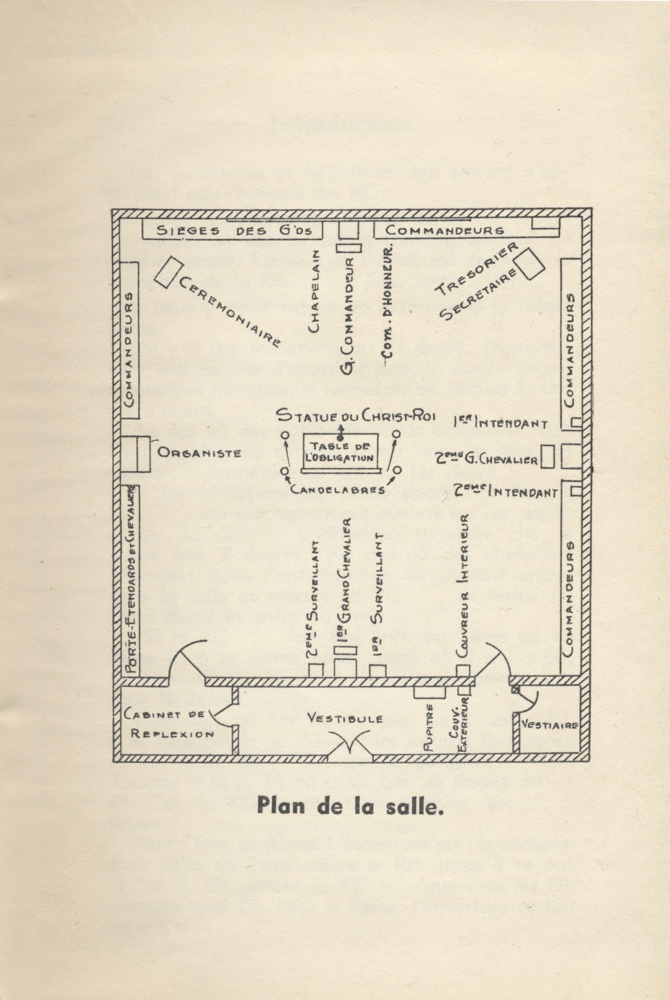

<!-- ENTETE -->

---

    

--- 

<!-- FIN ENTETE -->

# Pró e anti-maçonaria

**Título provisório:**O pró e anti maçonismo nos órgãos de imprensa da província de Quebec no séc XIX** 

**Plano geográfico:** Província do Québec

**Timeframe:** séc XIX

**Público alvo:** público maçônico, todos os graus; público em geral. Proposição de publicação na revista da Loja de Pesquisas Dom Bosco no. 33.

**Idioma primário:** português

**Fontes de pesquisa:** bibliografia maçônica; sites de arquivos de jornais antigos; arquivos PDF recuperados das bibliotecas virtuais do GOB, da CMSB, entre outros. 

## Questões para pesquisa

- Panorama político em Quebec no séc XIX
- Background histórico: Nouvelle France
- Conquista
- Francês x Inglês
- Background religioso: católico x protestante (anglicano/luterano/metodists/episcopal); bulas papais de condenação à FM; apartenance de católicos à ordem
- Panorama político em Québec no sec XIX
- Reação católica: Chevaliers de Coulombe;  Ordre de Jacques Cartier (tardiamente)
- Cobertura midiática sobre a FM

## Bulas papais:
- In eminenti apostolatus, Papa Clemente XII, 1738 
- Providas romanorum, Bento XIV, 1751
- Humanum genus, Leão XIII, 1884

## Ordre de Jacques Cartier 

**Fondation de l'Ordre de Jacques-Cartier**   
https://perspective.usherbrooke.ca/bilan/quebec/evenements/20135

**L'Ordre de Jacques Cartier, société secrète**   
http://www.viefrancaisecapitale.ca/pouvoir/lordre_de_jacques_cartier_societe_secrete-fra#main-content  
http://www.viefrancaisecapitale.ca/pouvoir/linitiation-fra#_ftn1  

**Photo du rituel, plan de la XC. Source: Vie Française Capitale** 

## Knights of Columbus 

# Referências

Hamon, É., La maçonnerie canadienne-française /, Québec (Province), s.n., 1886, v, 189 p. ; 15 cm, Collections de BAnQ.   
https://numerique.banq.qc.ca/patrimoine/details/52327/2023030

La Franc-Maçonnerie Ennemie de l'Église et de la patrie   
https://collections.banq.qc.ca/bitstream/52327/2241085/1/75353.pdf

La franc-maçonnerie dans la province de Québec en 1883 (Jean d'Erbrée)   
Hamon, É., La franc-maçonnerie dans la province de Québec en 1883 /, Québec (Province), s.n., 1883, 276 p. ; 19 cm, Collections de BAnQ.   
https://numerique.banq.qc.ca/patrimoine/details/52327/2021763?docref=j5V_5jg0X6XiYVaWmYoPTg

Padre Paulo Ricardo   
https://padrepauloricardo.org/blog/a-verdadeira-razao-pela-qual-catolicos-nao-podem-ser-macons

Country :	France.   
Language :	French.    
Gender :	Masculin.   
Birth :	Vitré (Ille-et-Vilaine), 08-11-1841.    
Death :	Leeds (Québec), 11-06-1904.    
Note :	Jean d'Erbrée est un pseudonyme utilisé par Édouard Hamon, jésuite, qui écrivit également sous son nom véritable.    
Outre le titre signalé ci-dessous, le même auteur a publié sous le même pseudonyme, vers 1884 : «La Maçonnerie canadienne-française».    
ISNI : 	[ISNI 0000 0001 0801 2231](https://isni.oclc.org/cbs/DB=1.2/CMD?ACT=SRCH&IKT=8006&TRM=ISN%3A0000000108012231&TERMS_OF_USE_AGREED=Y&terms_of_use_agree=send) (Information about ISNI)

