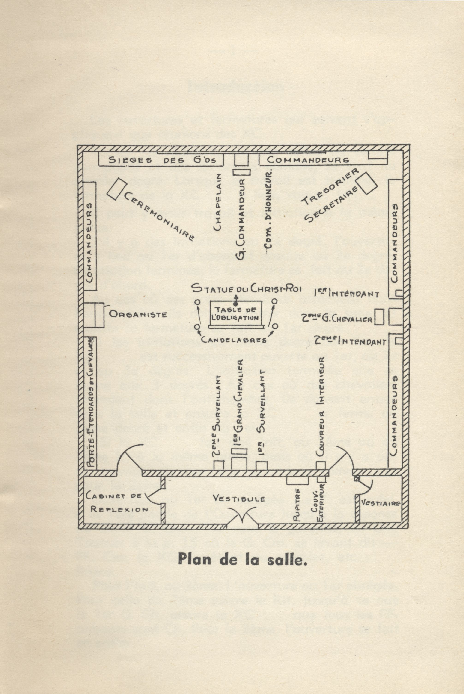

<!-- ENTETE -->

---

    

--- 

<!-- FIN ENTETE -->

# L'Antimaçonnisme 

**Titre provisoire: **L'antimaçonnisme catholique dans la presse québécoise du 19è et 20è siècle** 

**Plan geographique:** Province de Québec

**Timeframe:** 19è et 20è siècles

**Publique cible:** publique maçonnique, tous les grades; publique en général. Porposition de publication à la revue de la Loge de Recherches Dom Bosco, n0. 33.

**Langue primaire:** portugais et français. 

**Sources de recherche:** bibliographie maçonnique; sites d'arquivos de jornais antigos; arquivos PDF recuperados das bibliotecas virtuais do GOB, da CMSB, entre outros. 

## Questões para pesquisa

- Panorama político em Quebec no séc XIX
- Background histórico: Nouvelle France
- Conquista
- Franceses x Ingleses
- Background religioso: católico x protestante (anglicano/luterano/metodists/episcopal); bulas papais de condenação à FM; apartenance de católicos à ordem
- Panorama político em Québec no sec XIX
- Reação católica: Chevaliers de Coulombe;  Ordre de Jacques Cartier (tardiamente)
- Cobertura midiática sobre a FM; jornais pró (anglófonos) e anti (francófonos) 

## Bulas papais:
- In eminenti apostolatus, Papa Clemente XII, 1738 
- Providas romanorum, Bento XIV, 1751
- Humanum genus, Leão XIII, 1884

## Ordre de Jacques Cartier 

**Fondation de l'Ordre de Jacques-Cartier**   
https://perspective.usherbrooke.ca/bilan/quebec/evenements/20135

**L'Ordre de Jacques Cartier, société secrète**   
http://www.viefrancaisecapitale.ca/pouvoir/lordre_de_jacques_cartier_societe_secrete-fra#main-content  

**L'initiation**   
http://www.viefrancaisecapitale.ca/pouvoir/linitiation-fra#_ftn1  

**L’ordre secret de Jacques-Cartier**   
https://www.ledevoir.com/culture/cinema/783263/rendez-vous-quebec-cinema-l-ordre-de-jacques-cartier

**Fonds Ordre de Jacques-Cartier**   
https://advitam.banq.qc.ca/notice/332245

**Photo du rituel, plan de la XC. Source: Vie Française dans la Capitale** 

## Knights of Columbus 

## Jornais 

Anti:

- Action Catholique
- L'événement
- Le Canada

Pro:

- Quebec Chronicle
- Montreal Daily

There is no other body of men to whom one may appeal with greater confidence to accept this challenge, than Freemasons, men who in the most solemn manner have professed their belief in God and in all his teachings, and who, in the most solemn oath, have obligated themselves to be loyal citizens and to maintain the ideals of righteousness, liberty, justice and the sanctity of the law.  [Quebec Chronicle 3 dec 1921]

Il n'y a pas d'autre groupe d'hommes à qui l'on puisse demander avec plus de confiance de relever ce défi que les francs-maçons, des hommes qui, de la manière la plus solennelle, ont professé leur foi en Dieu et en tous ses enseignements, et qui, par le serment le plus solennel, se sont engagés à être des citoyens loyaux et à maintenir les idéaux de droiture, de liberté, de justice et de sainteté de la loi.

# Referências

Hamon, É., La maçonnerie canadienne-française / Québec (Province), s.n., 1886, v, 189 p. ; 15 cm, Collections de BAnQ.   
https://numerique.banq.qc.ca/patrimoine/details/52327/2023030

La Franc-Maçonnerie Ennemie de l'Église et de la patrie   
https://collections.banq.qc.ca/bitstream/52327/2241085/1/75353.pdf

La franc-maçonnerie dans la province de Québec en 1883 (Jean d'Erbrée)   
Hamon, É., La franc-maçonnerie dans la province de Québec en 1883 /, Québec (Province), s.n., 1883, 276 p. ; 19 cm, Collections de BAnQ.   
https://numerique.banq.qc.ca/patrimoine/details/52327/2021763?docref=j5V_5jg0X6XiYVaWmYoPTg

Padre Paulo Ricardo   
https://padrepauloricardo.org/blog/a-verdadeira-razao-pela-qual-catolicos-nao-podem-ser-macons

**Biographie**   
Jean d'Erbrée pseud. Édouard Hamon, SJ   
Country :	France.    
Language :	French.     
Gender :	Masculin.    
Birth :	Vitré (Ille-et-Vilaine), 08-11-1841.    
Death :	Leeds (Québec), 11-06-1904.    
Note :	Jean d'Erbrée est un pseudonyme utilisé par Édouard Hamon, jésuite, qui écrivit également sous son nom véritable.    
Outre le titre signalé ci-dessous, le même auteur a publié sous le même pseudonyme, vers 1884 : «La Maçonnerie canadienne-française».    
ISNI : 	[ISNI 0000 0001 0801 2231](https://isni.oclc.org/cbs/DB=1.2/CMD?ACT=SRCH&IKT=8006&TRM=ISN%3A0000000108012231&TERMS_OF_USE_AGREED=Y&terms_of_use_agree=send) (Information about ISNI)

## Bibliographie 

Hugues Théorêt (2024). **La Patente: L’Ordre de Jacques Cartier, le dernier bastion du Canada Français.** Québec: Septentrion.

Ordre de Jacques Cartier (1962). **L’Émerillon: Vol 41 N 8 Octobre 1962.** Ottawa:Imprimerie de Ordre de Jacques Cartier.

Robillard, D. (2009). **L’Ordre de Jacques Cartier: Une société secrète pour les Canadiens français catholiques 1926-1965.** Montréal: Fides.

Leon XIII (1942). **La Franc-Maçonnerie: Lettre Encyclique ”Humanun Genus” de Leon XIII.** Montréal: École Sociale Populaire.

R P Couet, OP (1910). **La Franc-Maçonnerie et la Conscience Catholique: Étude sur la Dénonciation Juridique.** Montréal: Imprimerie de l’Action Sociale.

**Vie Française dans la Capitale.** Capsule: L'Initiation. URL: https://www.viefrancaisecapitale.ca/pouvoir/linitiation-fra
