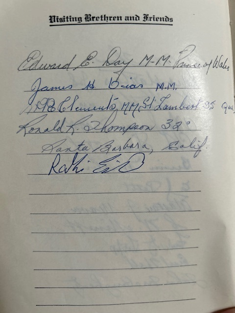

<!-- ENTETE -->

---

    

--- 

<!-- FIN ENTETE -->

# **Harry Ralph Thompson** 

||CIVIL DATA|
|---|---|
|Name|Harry Ralph Thompson|
|Date of birth||
|Place of birth||
|Father||
|Mother||
|Next of kin||
|Occupation||
|Religion||
|Date of death||
|Place of death||
|Age at death||
|Burial site||

Initiated in [Riverdale Lodge #494](http://www.rjrr494.com/index.html) in April 9th 1965   
Grand Lodge of Canada in the Province of Ontario   

http://www.rjrr494.com/index.html
https://www.flickr.com/photos/21728045@N08/albums/

Served in the Korea War, Canadian Navy

## **His Wife: Phylis Alexandra Thompson née Young**   
Phyllis Alexandra Thompson, née Young   
January 10th, 1931, Quebec City, QC — April 5th, 2020 Scarborough, ON
https://www.basicfunerals.ca/obituaries/Phyllis-Thompson

**Certificate Master Mason H R Thompson. Source: photo familliale.**

**Bible presented to Harry R Thompson. Source: photo familliale.**

**Visitors signing Bible of Harry R Thompson. Source: photo familliale.**

## **His Daughter: Jayne Thompson-Cascagnette**

